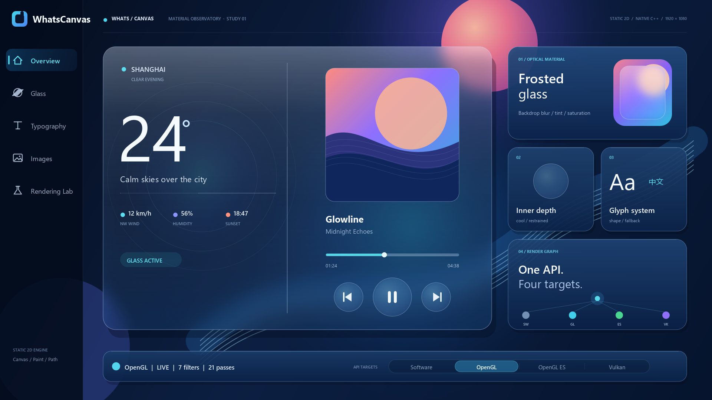

# WhatsCanvas

[](LICENSE)
[](CHANGELOG.md)
[](CMakeLists.txt)
[](doc/GETTING_STARTED_AS_LIBRARY.md)

WhatsCanvas 是一个用 C++17 编写的轻量级二维渲染引擎项目，以 Canvas 的使用方式对外呈现。

它不是要取代 Skia 这类成熟的大型框架，也不是只停留在 NanoVG 这类极简轻量绘制层。它更像是介于两者之间的一种选择：比大型框架更轻、更容易接入和阅读，比极简绘图库更完整，既能拿来做 UI 和 2D 游戏项目，也适合作为学习 Canvas 渲染原理的工程样本。

## 项目定位

- 对外提供的是 Canvas 风格 API，而不是底层图形接口的直接暴露。
- 定位偏轻量，强调易接入、易阅读、易验证，适合中小型项目、工具型界面、2D 游戏和教学场景。
- 项目自带根工程演示、游戏示例、跨平台 CI、冒烟脚本、像素回归钩子和专题文档，方便试用、学习和继续演进。
- 当前提供四个可选渲染后端：桌面 OpenGL、OpenGLES、纯 CPU 软件后端（不依赖任何 GPU），以及可选的 Vulkan 后端；Metal / Direct3D / WebGPU 等仍保留扩展空间。

## 能力总览

WhatsCanvas 的公开接口仍然是熟悉的 `Canvas` / `Paint` / `Path` / `Image` / `FontFace`，但按能力看会更直观：

| 能力组 | 已实现能力 | 代表入口 |
| --- | --- | --- |
| 基础绘制 | 点、线、折线、多边形、矩形、圆角矩形、圆、椭圆、圆弧、任意路径。 | `drawPoint`、`drawLine`、`drawRect`、`drawRoundRect`、`drawCircle`、`drawOval`、`drawArc`、`drawPath` |
| 路径与几何 | `Path` 构建、曲线 flatten、路径 bounds、fill/stroke hit-test、stroke bounds、虚线、圆角路径效果、Polyline2D 描边网格。 | `Path`、`measureStrokeBounds`、`hitTestPathFill`、`hitTestPathStroke`、`Paint::setDashPathEffect` |
| 绘制样式 | 填充、描边、透明度、逐 `Paint` 解析抗锯齿、线性 / 径向 / 多 stop 渐变、混合模式、真高斯模糊阴影（填充 / 描边 / 文本）、采样质量、图像 tile mode、颜色矩阵。 | `Paint`、`setAntiAlias`、`setLinearGradient`、`setRadialGradient`、`setBlendMode`、`setShadowLayer`、`setColorMatrix` |
| Canvas 状态 | `save` / `restore`、矩阵变换、矩形裁剪、抗锯齿路径裁剪、`saveLayer` 离屏层、render-target canvas、clip 查询、quick reject。 | `save`、`restore`、`translate`、`scale`、`rotate`、`clipRect`、`clipPath`、`saveLayer`、`quickReject` |
| 图像滤镜与合成 | `ImageFilter` 图层滤镜、真正采样已绘制背景的 backdrop blur、基于图层轮廓且不向外溢出的内阴影、半径 / sigma 两种模糊参数、模糊后饱和度 / 亮度 / 对比度调整、稳定单色颗粒、毛玻璃预设、Clamp / Decal 边界模式；Software 提供确定性参考实现，OpenGL / OpenGLES / Vulkan 使用 GPU 卷积，并对大面积高半径模糊按轴自适应使用 2x 降采样和全分辨率恢复。 | `ImageFilter::blur`、`ImageFilter::blurSigma`、`ImageFilter::innerShadow`、`ImageFilter::innerShadowSigma`、`ImageFilter::frostedGlass`、`setColorAdjustment`、`setGrain`、`LayerOptions::setImageFilter`、`LayerOptions::setBackdropFilter`、`saveLayer` |
| 图像与纹理 | 文件解码、encoded memory、raw RGBA、外部纹理包装、整图替换、局部更新、contain / cover / fill 布局、锚点、九宫格、圆角裁剪、圆形裁剪、平铺绘制。 | `Image`、`drawImage`、`drawImageFit`、`drawImageNinePatch`、`drawImageRounded`、`drawImageCircle`、`drawImageTiled`、`wrapExternalTexture` |
| 字体与文本 | 系统字体发现 + fallback chain、weight/slant 匹配、TrueType/TTC/内存字体与 collection face index、FreeType（不可用回退 stb）glyph lookup/metrics/kerning/栅格化、HarfBuzz shaping（回退 simple shaping）、多字体 fallback 分段、GPU glyph atlas（dirty-rect 更新 + resize-before-evict + 统计）、COLR/CPAL v0 彩色字形、UTF-8 布局 + CJK 无空格折行 + 省略号 + baseline + letter spacing、渐变/描边/阴影文本、text-on-path、缺字与回退诊断、Unicode UAX #9 全量通过。 | `FontSystem`、`FontFace`、`FontManager`、`FontFallbackChain`、`registerFontFace`、`setFontFallbackChain`、`drawText`、`drawTextBox`、`layoutTextBox`、`drawTextOnPath`、`measureTextMetrics` |
| 渲染后端 | 桌面 OpenGL 主路径、OpenGLES 目标、纯 CPU 软件后端（零 GPU 依赖、可在无图形栈环境运行）、可选 Vulkan 后端（默认离屏，Windows 支持 Canvas 窗口呈现）、共享 GL-family 后端、proc-address 注入、上下文生命周期、资源释放与重建、shader portability。 | `Canvas::loadOpenGL`、`Canvas::create`、`Canvas::isBackendAvailable`、`WhatsCanvas::OpenGL`、`WhatsCanvas::OpenGLES`、`WhatsCanvas::Software`、`initializeContext`、`releaseResources` |
| 性能与资源 | 流式顶点缓冲、图片命令同纹理合批、统一圆角图片的原生 shader coverage、路径命令合批、Vulkan 路径阴影 silhouette 批量提交、局部阴影栅格化 / GPU 模糊、全局 quad index buffer、离屏 render target 复用池、GPU glyph atlas 复用、indexed glyph lookup、填充三角化 / 描边网格 / 裁剪掩码 LRU 缓存、滤镜调用 / pass / 降采样 / pixel-pass 统计；统一 Release 性能套件以 1920×1080 覆盖 14 个真实帧场景，包括大量多语种文字与混合几何压力，并提供先做像素质量门禁、再比较完整帧耗时的跨库基准契约。 | `WhatsCanvasPerformanceSuite`、`Renderer`、`RenderTargetPool`、`GlyphAtlas`、`LruCache`、`RenderStats` |
| 诊断与验证 | 同步 / 异步像素回读、PPM 截图、像素哈希、fuzzy PPM 对比、软件后端 golden-image 回归（确定性、无需 GPU）、OpenGL / OpenGLES / Vulkan 滤镜像素一致性门禁、固定时间首帧冒烟、示例构建冒烟、Unicode Bidi conformance、跨平台 CI。 | `readPixelsRGBA`、`readPixelsRGBAAsync`、`savePixelsPPM`、`computePixelsHashRGBA`、`FILTER_PARITY`、`ctest`、`scripts/*_smoke.*` |

## 与常见 2D 图形库的能力参照

这不是功能或性能排名，而是帮助使用者快速判断不同方案的设计重心和适用场景。

| 方案 | 特色差异 | 更适合的场景 |
| --- | --- | --- |
| **WhatsCanvas** | 可独立嵌入的 C++17 Canvas API，内建文本 shaping、fallback、双向文本、布局与栅格化链路，以及毛玻璃和内阴影等图层效果；提供确定性 Software 基线、OpenGL / OpenGLES / 可选 Vulkan 后端，并持续执行滤镜像素对比和视觉回归。 | 原生应用的自定义 2D 渲染层、工具与数据界面、HUD、2D 游戏的渲染层或 UI，以及同时需要多语言文本、静态视觉效果和可重复验证的项目。 |
| **[Skia](https://skia.org/)** | 被浏览器和大型跨平台框架采用的通用图形引擎，平台覆盖、颜色管理、图像处理、路径和效果生态更广；相应的构建、体量控制和集成范围也更大。 | 大型产品、跨平台应用框架，以及优先考虑能力上限和成熟图形基础设施的长期项目。 |
| **[NanoVG](https://github.com/memononen/nanovg)** | API 和依赖范围较小，围绕 OpenGL 提供即时模式矢量绘制；复杂文本、多后端资源模型、图层滤镜和系统化视觉回归不是其设计重点。 | 调试面板、可视化原型、游戏内简单 UI，以及只需要基础路径、图片和文字的小型 OpenGL 项目。 |
| **HTML Canvas 2D** | 浏览器原生，无需部署 C++ 图形运行时，可直接与 JavaScript、DOM 和 Web API 协作；底层实现和跨浏览器渲染差异由浏览器管理。WhatsCanvas 的 WebAssembly 支持目前仍处于规划阶段。 | 网站、在线图表、Web 小游戏和以浏览器为唯一运行环境的内容。 |

## 字体与文本

**文本栈是 WhatsCanvas 最突出的优势。** 同级别的轻量 2D 库（NanoVG、Cairo、多数嵌入式渲染器）通常只做基础 `stb_truetype` 文字，把复杂排版、fallback、shaping 甩给应用层；WhatsCanvas 把一条**逼近 Skia、远超 NanoVG** 的完整文本链路直接内建：

- **真正的 shaping**：HarfBuzz OpenType shaping（不可用时回退 simple shaping + kerning），而不是只按字形宽度堆字。
- **多字体 fallback 分段**：`FontFallbackChain` 按 resolved face 把混排文本自动分段，CJK / 拉丁 / 符号各取其字体——不是"找不到就豆腐块"。
- **完整 Unicode 双向文本**：内置 Unicode 17.0.0 数据，UAX #9 exhaustive conformance **861,948 cases、0 失败**，这是多数同级库根本没有的。
- **彩色字形**：COLR/CPAL v0 分层字形解码、合成到 RGBA glyph atlas。
- **生产级字形管线**：FreeType（不可用回退 stb）栅格化 + GPU glyph atlas（dirty-rect 更新、resize-before-evict、LRU 上限与统计）+ 系统字体发现 + weight/slant 匹配 + 文件/内存/TTC 字体。
- **排版细节**：UTF-8 布局、CJK 无空格折行、省略号、baseline、letter spacing、渐变/描边/阴影文本、text-on-path，以及缺字与回退诊断。


上图由 `WhatsCanvasDemo` 的 `text-showcase` 场景真实捕获。更多细节见 [Text Feature Matrix](doc/TEXT_FEATURE_MATRIX.md) 与 [字体渲染专题](doc/Font%20Rendering%20Techniques/index.html)。

## 图像滤镜与毛玻璃

`ImageFilter` 可以处理离屏层自身内容，也可以通过 backdrop filter 采样并模糊已经绘制的场景。后者适合制作毛玻璃面板、半透明 HUD、浮层和模态界面。`frostedGlass` 在真实高斯模糊后继续完成饱和度、亮度、对比度与细颗粒处理；`innerShadow` 则从图层 alpha 生成受轮廓约束的内阴影，适合凹槽、按键、卡片和材质厚度表现。面板 tint、描边、文字和控件仍使用普通 Canvas API 绘制。

滤镜的图层语义、透明边界、降采样策略和不同后端支持情况见 [Image Filters And Backdrop Effects](doc/IMAGE_FILTERS.md)。

## Showcase：材质观测台

这张 Showcase 不是预制界面截图，而是一帧由 WhatsCanvas 完整绘制、通过桌面 OpenGL framebuffer 直接回读的 `1920 x 1080` PNG。它把几项核心能力组合成一个接近真实产品的静态画面：

- **主玻璃舞台**：真实 backdrop blur、透明 tint、饱和度与亮度调节共同形成有层次的毛玻璃，而不是简单半透明填充。
- **克制的材质深度**：播放器控件和右侧样本使用冷色 `innerShadow` 表达凹面结构，避免常见的黑脏阴影。
- **完整文字链路**：拉丁字形、CJK fallback、weight、布局与 glyph atlas 在同一画面中工作；示例额外注册便携 CJK 字体，保证跨平台输出稳定。
- **统一渲染接口**：右下角渲染图谱表达同一 Canvas API 面向 Software、OpenGL、OpenGLES 和 Vulkan 的关系；底栏只高亮本次实际运行的 OpenGL，并显示真实滤镜统计。
- **全 Canvas 生成**：背景光场、观测环、抽象专辑图、路径、渐变、裁剪、文字和控件全部动态绘制，没有嵌入 UI 截图。



可用 `WhatsCanvasImageFilterShowcase <输出路径>` 重新生成。解析抗锯齿、多 stop 渐变、高斯阴影和路径裁剪等基础画质能力仍列在上方能力总览中，专项实现与验证资料可从文档入口继续查看。

## 示例

仓库自带两个可运行的游戏示例，演示布局、文本面板、滚动场景、裁剪区域与 HUD：

<table>
<tr>
<td width="50%" align="center"><a href="examples/game/tetris"></a><br><b>Tetris</b> — 布局、文本面板、方块绘制与状态叠加</td>
<td width="50%" align="center"><a href="examples/game/racer"></a><br><b>Racer</b> — 滚动场景、裁剪、HUD 与动画驱动</td>
</tr>
</table>

单独构建（racer 同理）：

```bat
cd examples\game\tetris
build.bat --no-run
```

## 快速开始

**本地构建**（需要 CMake 3.16+ 与 C++17 编译器；Windows 用 VS 2022 桌面 C++ 工作负载，macOS / Linux 需 OpenGL 与可编译 GLFW 示例的系统图形开发库）：

```bat
build.bat            :: Windows：构建并运行 demo（--no-run 只构建，--package 生成交付目录）
```

```bash
./build.sh           # macOS / Linux（同样支持 --no-run / --package）
```

产物在 `build/<Config>/`；加 `--package` 会额外整理出 `out/package/<Config>/`（`lib/` 库文件 + `include/wsc/` 公共头）。

**最快接入**——纯 CPU 软件后端，不需要窗口、GL 上下文或 GPU，画完直接读像素：

```cpp
#include <wsc/wsc.h>

auto canvas = wsc::Canvas::create(wsc::Canvas::Backend::Software, 256, 256);   // 已尺寸就绪，beginFrame 时初始化
canvas->beginFrame();
wsc::Paint fill;
fill.setColor(wsc::Color(40, 120, 240, 255));
fill.setAntiAlias(true);
canvas->drawRoundRect(wsc::RectF(40, 40, 176, 176), 24.0f, fill);
canvas->endFrame();
canvas->savePixelsPPM("first.ppm");
```

**用 CMake 接入**（预编译 Release 包或 `--package` 生成的目录）：

```cmake
find_package(WhatsCanvas 0.1.16 CONFIG REQUIRED)
target_link_libraries(MyApp PRIVATE WhatsCanvas::OpenGL)   # 或 ::Software / ::OpenGLES（Vulkan 编入 ::OpenGL，运行时选择）
```

> 选后端、窗口/上下文、GitHub Release、OpenGLES、软件后端、Vulkan、常见任务——完整接入路径见
> **[接入指南 › Using WhatsCanvas as a Library](doc/GETTING_STARTED_AS_LIBRARY.md)**。

## 可选字体依赖

OpenType shaping implementation 可以通过 CMake option 打开。CMake 会优先使用 `third_party/harfbuzz`，如果子模块未初始化再查找系统 HarfBuzz；如果没有可用 adapter，会自动回退到 simple shaping，并在文本后端 diagnostics 中报告：

```cmake
cmake -S . -B build -DWHATSCANVAS_ENABLE_OPENTYPE_SHAPING=ON
```

字体栅格化默认会尝试启用 FreeType。CMake 会优先使用 `third_party/freetype`，如果子模块未初始化再查找系统 FreeType；找到 FreeType 时，注册字体的 glyph index、metrics、kerning 和 alpha glyph rasterization 会优先走 FreeType；找不到时自动回退到内置 `stb_truetype` 路径：

```cmake
cmake -S . -B build -DWHATSCANVAS_ENABLE_FREETYPE_RASTERIZER=ON
```

## 验证

常用验证入口：

```bat
ctest -C Debug -L unit --output-on-failure
cmd /c scripts\smoke_test.bat
cmd /c scripts\clip_path_smoke.bat
cmd /c scripts\regression_smoke.bat
cmd /c scripts\text_pixel_regression.bat
cmd /c scripts\examples_smoke.bat
cmd /c scripts\validation_scene_smoke.bat
cmd /c scripts\opengles_build_smoke.bat
cmd /c scripts\package_consumer_smoke.bat
cmd /c scripts\version_consistency_check.bat
cmd /c scripts\release_preflight.bat
ctest -C Debug -L smoke --output-on-failure
```

如果只想跑核心单元测试，优先使用 `ctest -C Debug -L unit --output-on-failure`。当前单元测试覆盖 GraphicsState / Path、文本布局、UTF-8 工具、FontManager、文本后端契约、文本回归、RenderStats、RenderTargetPool、CanvasAdapter、矩阵与裁剪、Paint 状态、Image 生命周期、Canvas 上下文生命周期、GlyphAtlas 和弃用提示。

发版前可以使用 `scripts\release_preflight.bat` 跑一组较快的本地预检：API reference freshness、版本一致性、Debug unit tests 和 package consumer smoke。它不会替代完整渲染回归，但可以覆盖最容易漏掉的公开 API、包消费和版本同步问题。

字体像素回归只覆盖文本渲染路径，默认捕获 `font-regression` 和 `text-showcase` 两个场景后与 `tests/baselines/text/*.ppm` 做 fuzzy comparison。需要刷新本机字体基准时，先设置 `WHATSCANVAS_UPDATE_TEXT_BASELINES=1`，再运行 `scripts\text_pixel_regression.bat`；需要临时缩小范围时可设置 `WHATSCANVAS_TEXT_REGRESSION_SCENES=font-regression`。

根 demo 支持一组捕获/回归环境变量（`WHATSCANVAS_CAPTURE_PPM`、`WHATSCANVAS_PRINT_PIXEL_HASH`、`WHATSCANVAS_EXIT_AFTER_FIRST_FRAME`、`WHATSCANVAS_FIXED_TIME_SECONDS`、`WHATSCANVAS_DISABLE_MSAA`、`WHATSCANVAS_VALIDATION_SCENE` 等），用于确定性截图与像素哈希校验。driver-sensitive 场景可用 `python scripts\compare_ppm_fuzzy.py baseline.ppm candidate.ppm` 做容差比较。

## 文档入口

- [Using WhatsCanvas as a Library](doc/GETTING_STARTED_AS_LIBRARY.md)：从打包、`find_package`、OpenGL/GLES 上下文到字体注册的最短接入路径。
- [Text Sharpness & HiDPI](doc/TEXT_SHARPNESS_AND_HIDPI.md)：文本清晰度（像素对齐、按设备分辨率栅格化）与 `setDevicePixelRatio` 高分屏接入。
- [DirectWrite Text Backend](doc/DIRECTWRITE_TEXT_BACKEND.md)：Windows 原生 DirectWrite 文本后端（灰度/ClearType、字间距、自定义字体文件/内存、回退链、locale 样式面板）。
- [Troubleshooting & FAQ](doc/TROUBLESHOOTING.md)：常见坑（黑图 tint、上下文未 current、后端回退、gamma、readback 方向）的排查。
- [API Stability](doc/API_STABILITY.md)：记录当前公开 API、CMake package target 和内部/实验边界。
- [Public API Reference](doc/API_REFERENCE.md)：由 `scripts/generate_api_reference.py` 从 `include/wsc/` 自动生成的公开 API 索引。
- [Image Filters And Backdrop Effects](doc/IMAGE_FILTERS.md)：图层滤镜、毛玻璃语义、后端状态、验证入口与后续路线。
- [Regression Baseline Policy](doc/REGRESSION_BASELINES.md)：记录文本、效果、smoke 和 OpenGLES baseline 的更新规则。
- [Release Checklist](doc/RELEASE_CHECKLIST.md)：记录版本同步、CI、artifact 和外部 consumer 验证步骤。
- [CHANGELOG](CHANGELOG.md)：记录版本发布内容与重要变更。
- [架构总览](doc/architecture/README.md)：适合先建立整体分层和模块边界认知。
- [Contributing](CONTRIBUTING.md)：本地构建、测试、PR 前校验（API reference / 版本一致性 / 单测）与仓库约定。
- [Text Feature Matrix](doc/TEXT_FEATURE_MATRIX.md)：定义文本、字体、fallback、layout、diagnostics 和后续 atlas 后端的能力边界。
- [Shader Portability Notes](doc/SHADER_PORTABILITY.md)：记录桌面 OpenGL / OpenGLES shader 版本、precision、状态 guard 和 GLES-only build gate。
- [iOS Build Notes](doc/IOS_BUILD_NOTES.md)：记录当前 OpenGLES target 在 iOS 宿主中的构建、上下文生命周期和验证边界。
- [Shadow Model](doc/SHADOW_MODEL.md)：记录 `Paint::setShadowLayer` 的当前契约、shape/text shadow 边界和后续 box-shadow 方向。
- [Visual Regression Notes](doc/VISUAL_REGRESSION.md)：记录严格 hash 与 fuzzy PPM comparison 的适用场景和命令。
- [Blend Mode Audit](doc/BLEND_MODE_AUDIT.md)：记录 `Paint::BlendMode` 到 GL-family blend state 的映射和限制。
- [Performance Benchmarks](doc/PERFORMANCE_BENCHMARKS.md)：记录统一三后端 1080p 帧性能套件、14 个标准场景、指标口径、JSONL 结果、版本对比、公开数据规则与可复现参考基线。
- [Cross-Library Benchmarks](doc/CROSS_LIBRARY_BENCHMARKS.md)：规定固定场景、字体与图像输入、同步计时、适配器接口和像素质量门禁，避免用降质输出换取跨库性能数字。
- [Effect Regression Matrix](doc/EFFECT_REGRESSION_MATRIX.md)：记录 gradients、shadows、blend modes、strokes 和 dashes 的回归覆盖入口。
- [Polyline2D 互动教学](doc/polyline/polyline2d_interactive_tutorial.html)：适合理解路径描边、网格生成和相关几何细节。
- [抗锯齿原理与实现互动教学](doc/anti_aliasing/anti_aliasing_interactive_tutorial.html)：适合理解什么是抗锯齿、不同实现方法和 WhatsCanvas 当前做法。
- [字体渲染专题](doc/Font%20Rendering%20Techniques/index.html)：适合补字体渲染、排版和文本后端相关知识。
- [功能演进记录](doc/CanvasEvaluation.md)：适合回看功能推进、验证方式和阶段性成果。
- [测试说明](tests/README.md)：适合查看本地测试入口和 Unicode Bidi conformance 说明。

公开 API 文档可通过 CMake target 刷新或检查：

```bat
cmake --build build --target WhatsCanvasGenerateApiReference
cmake --build build --target WhatsCanvasCheckApiReference
```

版本和安装包消费面也提供了对应的 CMake 检查入口：

```bat
cmake --build build --target WhatsCanvasCheckVersionConsistency
cmake --build build --target WhatsCanvasCheckPackageConsumer
```

## 架构

下面的图基于当前源码和 CMake 目标整理。当前实际 GL-family 构建目标是 `WhatsCanvasOpenGL`，可选目标是 `WhatsCanvasOpenGLES`，它们把 `src/canvas`、`src/text`、`src/command`、`src/render` 和 `src/opengl` 编进库；对外消费面主要是 `include/wsc/`。


关键代码事实：

- `cmake/WhatsCanvasOpenGL.cmake` 中的 `whatscanvas_add_opengl_library()` 和 `whatscanvas_add_opengles_library()` 明确把 canvas、text、command、render、opengl 源文件加入 GL-family 库目标。
- `include/wsc/Canvas.h` 是主要公共入口；`Canvas` 和 `Image` 都实现了 `ITextureSource`，所以普通图片和 render-target canvas 可以走同一套 `drawImage(const ITextureSource&)` 路径。
- `src/canvas/Canvas.cpp` 的 `Canvas::Impl` 持有 `std::unique_ptr<IRenderer>`、`std::unique_ptr<ITextBackend>`、`GraphicsStateStack`、`layerStack` 和 render-target image resource。
- `src/command/DrawCommand.*` 定义 Points、Lines、Path、Image、Text 五类命令；命令执行时先通过 `RenderContext` 应用 blend、scissor、clip mask，再进入对应 `Draw*Program`。
- `src/render/Renderer.*` 持有命令队列、`RenderContext` 和 `IRenderDevice`，并在 `flush()` 中执行命令，同时处理路径命令合批、像素回读、clip mask resource、image resource 和离屏渲染请求。
- `src/render/RenderDeviceFactory.cpp` 在桌面 OpenGL 构建中默认选择 `OpenGL`，OpenGLES 构建中默认选择 `OpenGLES`（二者复用 `OpenGLRenderDevice`）；启用 Vulkan 且设备可用时构造 `VulkanRenderDevice`，Metal 分支仍为 `nullptr` stub。纯 CPU 软件后端走独立的 `SoftwareRenderer`（`Canvas::create(Backend::Software, ...)`），不经过该工厂。
- `src/render/OpenGLRenderDevice.cpp` 负责初始化 Draw*Program、GlobalIndexBuffers、PixelFormatCaps，并创建 texture、FBO/render target、clip mask resource 和 readback；OpenGLES 目标通过编译定义切换 shader 版本和桌面 GL-only 状态。

## 后续方向

- 持续完善接入文档、专题文档与文档站点。
- 继续推进 CBDT/CBLC / SBIX / SVG / COLR paint graph 等 color glyph 解码、更高质量文本渲染，并完善 DirectWrite 的平台验证与性能覆盖；CoreText native text adapter 仍属于后续工作。
- 增强自动化验证、跨后端像素对齐与性能基准。
- 规划通过 Emscripten 将现有 OpenGLES 后端运行于 WebGL 2，并提供精简的 JavaScript / TypeScript 桥接，使 HTML `<canvas>` 可以动态调用 WhatsCanvas 绘制；该能力目前尚未实现或支持，详细范围见 [`CORE_CAPABILITY_TODO.md`](doc/CORE_CAPABILITY_TODO.md#phase-8-webassembly-and-javascript-bridge)。
- 在已有 OpenGL / OpenGLES / 软件 / Vulkan 后端之上，为 Metal / WebGPU 等保留清晰扩展边界。

## 许可证

WhatsCanvas 以 [MIT License](LICENSE) 发布。`third_party/` 下的组件（FreeType、HarfBuzz、GLFW、stb、polyline2d 等）各自遵循其原始许可证。
