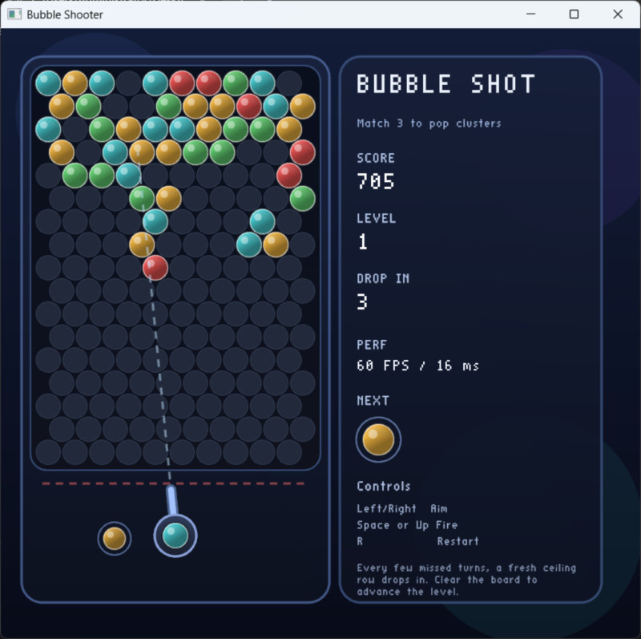

# WhatsCanvas

WhatsCanvas 是一个用 C++17 编写的轻量级二维渲染引擎项目，以 Canvas 的使用方式对外呈现。

它不是要取代 Skia、Cocos2d 这类成熟的大型框架，也不是只停留在极简轻量绘制层。它更像是介于两者之间的一种选择：比大型框架更轻、更容易接入和阅读，比极简绘图库更完整，既能拿来做 UI、工具界面和 2D 游戏项目，也适合作为学习 Canvas 渲染原理的工程样本。

本项目在设计时参考了 love2d 的 Canvas 风格和 Skia 的渲染抽象。

## 项目定位

- 当前以 OpenGL 路线最完整，并已提供 OpenGLES 编译目标；Vulkan、Metal 等后端仍保留扩展空间。
- 对外提供的是 Canvas 风格 API，而不是底层图形接口的直接暴露。
- 定位偏轻量，强调易接入、易阅读、易验证，适合中小型项目、工具型界面、2D 游戏和教学场景。
- 项目自带根工程演示、三个游戏示例、跨平台 CI、冒烟脚本、像素回归钩子和专题文档，方便试用、学习和继续演进。

## 能力总览

WhatsCanvas 的公开接口仍然是熟悉的 `Canvas` / `Paint` / `Path` / `Image` / `FontFace`，但按能力看会更直观：

| 能力组 | 已实现能力 | 代表入口 |
| --- | --- | --- |
| 基础绘制 | 点、线、折线、多边形、矩形、圆角矩形、圆、椭圆、圆弧、任意路径。 | `drawPoint`、`drawLine`、`drawRect`、`drawRoundRect`、`drawCircle`、`drawOval`、`drawArc`、`drawPath` |
| 路径与几何 | `Path` 构建、曲线 flatten、路径 bounds、fill/stroke hit-test、stroke bounds、虚线、圆角路径效果、Polyline2D 描边网格。 | `Path`、`measureStrokeBounds`、`hitTestPathFill`、`hitTestPathStroke`、`Paint::setDashPathEffect` |
| 绘制样式 | 填充、描边、透明度、逐 `Paint` 解析抗锯齿、线性 / 径向 / 多 stop 渐变、混合模式、阴影、采样质量、图像 tile mode、颜色矩阵。 | `Paint`、`setAntiAlias`、`setLinearGradient`、`setRadialGradient`、`setBlendMode`、`setShadowLayer`、`setColorMatrix` |
| Canvas 状态 | `save` / `restore`、矩阵变换、矩形裁剪、路径裁剪、`saveLayer` 离屏层、render-target canvas、clip 查询、quick reject。 | `save`、`restore`、`translate`、`scale`、`rotate`、`clipRect`、`clipPath`、`saveLayer`、`quickReject` |
| 图像与纹理 | 文件解码、encoded memory、raw RGBA、外部纹理包装、整图替换、局部更新、contain / cover / fill 布局、锚点、九宫格、圆角裁剪、圆形裁剪、平铺绘制。 | `Image`、`drawImage`、`drawImageFit`、`drawImageNinePatch`、`drawImageRounded`、`drawImageCircle`、`drawImageTiled`、`wrapExternalTexture` |
| 字体与文本 | 跨平台 TrueType / TTC 注册、file / memory 字体、collection face index、FreeType glyph lookup / metrics / kerning / rasterization、stb fallback、HarfBuzz shaping、simple shaping fallback、多字体 fallback 分段、真实 ascent / descent / lineGap、GPU glyph atlas、dirty rect atlas update、RGBA atlas、COLR/CPAL v0 color glyph、UTF-8 layout、CJK no-space wrapping、Unicode space、zero-width break、ellipsis、baseline、letter spacing、描边文本、文本阴影、text-on-path、缺字诊断、Unicode UAX #9 全量通过。 | `FontFace`、`FontManager`、`FontFallbackChain`、`registerFontFace`、`setFontFallbackChain`、`drawText`、`drawTextBox`、`layoutTextBox`、`drawTextOnPath`、`measureTextMetrics` |
| 渲染后端 | 桌面 OpenGL 主路径、OpenGLES 目标、共享 GL-family 后端、proc-address 注入、上下文生命周期、资源释放与重建、shader portability。 | `Canvas::loadOpenGL`、`WhatsCanvas::OpenGL`、`WhatsCanvas::OpenGLES`、`initializeContext`、`releaseResources` |
| 性能与资源 | 流式顶点缓冲、图片命令同纹理合批、路径命令合批、全局 quad index buffer、离屏 render target 复用池、GPU glyph atlas 复用、桌面 GL texel buffer 渐变 stop、OpenGLES fallback。 | `Renderer`、`RenderTargetPool`、`GlyphAtlas`、`RenderStats` |
| 诊断与验证 | 同步 / 异步像素回读、PPM 截图、像素哈希、fuzzy PPM 对比、固定时间首帧冒烟、OpenGLES 构建冒烟、示例构建冒烟、Unicode Bidi conformance、跨平台 CI。 | `readPixelsRGBA`、`readPixelsRGBAAsync`、`savePixelsPPM`、`computePixelsHashRGBA`、`ctest`、`scripts/*_smoke.*` |

## 字体与文本

字体系统已经从早期演示型文字绘制推进到一条完整链路：字体注册、fallback、shaping、glyph rasterization、atlas upload、Canvas 绘制和诊断验证都已经打通。

- 跨平台字体路径支持文件字体、内存字体、TrueType Collection 和 collection face index。
- FreeType 可用时优先用于 glyph lookup、metrics、kerning 和 alpha glyph rasterization；不可用时自动回退到内置 `stb_truetype`。
- HarfBuzz 作为可选 OpenType shaping implementation 接入；未启用或不可用时保留 simple shaping 和 kerning fallback。
- `FontFace`、`FontDescriptor`、`FontFallbackChain`、`FontManager` 和后端契约已经成型，文本会按 resolved font face 分段后再 shaping/raster/render。
- `GlyphAtlas` 管理 glyph allocation、dirty rect、context rebuild keys 和 atlas stats；Canvas 侧拥有持久 GPU atlas resource，并支持局部更新和 atlas 文本阴影采样。
- 已支持 color font table detection，COLR/CPAL v0 layered glyph 可以解码、合成到 RGBA glyph bitmap，并通过 RGBA atlas 管线绘制。
- UTF-8-safe layout、CJK no-space wrapping、Unicode spaces、zero-width break、ellipsis、baseline、line height、text box layout、text-on-path 和缺字诊断已经纳入统一文本路径。
- 内置 Unicode 17.0.0 `BidiTest.txt` / `BidiCharacterTest.txt` 数据和 conformance target；exhaustive conformance 已通过 861,948 cases、0 skips、0 failures。

更多细节见 [Text Feature Matrix](doc/TEXT_FEATURE_MATRIX.md) 和 [字体渲染专题](doc/Font%20Rendering%20Techniques/index.html)。

## 画质与渲染

填充与描边支持逐 `Paint` 的**解析抗锯齿**：沿轮廓生成一圈跨骑真实边缘的 ~1px 羽化带，由片元着色器按覆盖度调制 alpha。它是分辨率无关的，不依赖 MSAA，且对所有渲染目标含离屏 FBO 生效；细描边还会做亚像素淡化处理。默认关闭，按需逐 `Paint` 开启：

```cpp
Paint paint;
paint.setAntiAlias(true);
```

下图左侧关闭、右侧开启抗锯齿：


渐变为片元级求值，支持多 stop 的线性 / 径向渐变，避免顶点色在大三角上的分带：


对比图可用示例 `WhatsCanvasAAShowcase` 复现：`WhatsCanvasAAShowcase <输出路径>` 会生成 `aa_comparison.png` 与同目录的 `gradient_comparison.png`。

## 快速开始

环境要求：

- CMake 3.16 或更新版本。
- 支持 C++17 的编译器。
- Windows：Visual Studio 2022 + 桌面 C++ 工作负载。
- macOS / Linux：OpenGL 开发环境，以及可编译 GLFW 示例的系统图形开发库。

Windows：

```bat
build.bat --no-run
build.bat
build.bat --package --no-run
```

macOS / Linux：

```bash
chmod +x build.sh
./build.sh --no-run
./build.sh
./build.sh --package --no-run
```

默认构建产物位于 `build/Debug/` 或 `build/Release/`。如果加上 `--package`，脚本会额外整理出一份更适合交付的目录：

- Windows：`out\package\Debug\` 或 `out\package\Release\`
- macOS / Linux：`out/package/Debug/` 或 `out/package/Release/`

其中库文件在 `lib/`，公共头入口在 `include/wsc/`。

## 作为库接入

如果你希望把 WhatsCanvas 当成库使用，推荐使用 `--package` 生成交付目录，再在你的项目中通过 CMake 包方式接入。

```bat
build.bat --release --package --no-run
```

```cmake
find_package(WhatsCanvas 0.1.10 CONFIG REQUIRED)

add_executable(MyApp main.cpp)
target_link_libraries(MyApp PRIVATE WhatsCanvas::OpenGL)
```

最常见的头文件入口：

```cpp
#include <wsc/wsc.h>
```

如果你只想按模块引入，也可以分别包含 `wsc/Canvas.h`、`wsc/Paint.h`、`wsc/Path.h`、`wsc/Image.h`、`wsc/Font.h` 和 `wsc/base.h`。

安装包的消费面默认暴露 `WhatsCanvas::OpenGL` 和 `include/wsc/`。如果构建时打开 `WHATSCANVAS_BUILD_OPENGLES`，也会额外导出 `WhatsCanvas::OpenGLES`。GLFW 只用于仓库内 examples 的窗口与事件循环，GLAD 被编进 GL-family 后端，GLM 只作为内部数学实现依赖；普通消费者不需要 include 或链接这三者。

如果你的应用自己创建 OpenGL 上下文，需要在使用 Canvas 前把平台的 proc-address 函数交给库：

```cpp
Canvas::loadOpenGL(reinterpret_cast<Canvas::OpenGLProcAddress>(glfwGetProcAddress));
```

OpenGLES 后端使用同一套 Canvas API 和 proc-address 加载入口，适合由宿主应用自行创建 EGL / 平台 OpenGLES 上下文后接入：

```cmake
cmake -S . -B build-gles -DWHATSCANVAS_BUILD_OPENGLES=ON
target_link_libraries(MyApp PRIVATE WhatsCanvas::OpenGLES)
```

当前 OpenGLES 目标复用 GL-family 渲染设备实现，会启用 GLES shader 版本并跳过桌面 OpenGL-only 状态，例如 `GL_FRAMEBUFFER_SRGB` 和 `GL_PROGRAM_POINT_SIZE`。

## 可选字体依赖

OpenType shaping implementation 可以通过 CMake option 打开。CMake 会优先使用 `third_party/harfbuzz`，如果子模块未初始化再查找系统 HarfBuzz；如果没有可用 adapter，会自动回退到 simple shaping，并在文本后端 diagnostics 中报告：

```cmake
cmake -S . -B build -DWHATSCANVAS_ENABLE_OPENTYPE_SHAPING=ON
```

字体栅格化默认会尝试启用 FreeType。CMake 会优先使用 `third_party/freetype`，如果子模块未初始化再查找系统 FreeType；找到 FreeType 时，注册字体的 glyph index、metrics、kerning 和 alpha glyph rasterization 会优先走 FreeType；找不到时自动回退到内置 `stb_truetype` 路径：

```cmake
cmake -S . -B build -DWHATSCANVAS_ENABLE_FREETYPE_RASTERIZER=ON
```

## 示例

### Tetris

位于 [examples/game/tetris](examples/game/tetris)。这是一个很适合学习布局、文本面板、方块绘制和游戏状态叠加的示例。


### Racer

位于 [examples/game/racer](examples/game/racer)。这个示例更强调滚动场景、裁剪区域、HUD，以及节奏明确的动画驱动。


### Bubble Shooter

位于 [examples/game/bubble_shooter](examples/game/bubble_shooter)。适合学习网格排布、瞄准辅助线和轻量 UI 绘制。



示例单独构建：

```bat
cd examples\game\tetris
build.bat --no-run
```

```bat
cd examples\game\racer
build.bat --no-run
```

```bat
cd examples\game\bubble_shooter
build.bat --no-run
```

## 验证

常用验证入口：

```bat
ctest -C Debug -L unit --output-on-failure
cmd /c scripts\smoke_test.bat
cmd /c scripts\clip_path_smoke.bat
cmd /c scripts\regression_smoke.bat
cmd /c scripts\examples_smoke.bat
cmd /c scripts\validation_scene_smoke.bat
cmd /c scripts\opengles_build_smoke.bat
ctest -C Debug -L smoke --output-on-failure
```

如果只想跑核心单元测试，优先使用 `ctest -C Debug -L unit --output-on-failure`。当前单元测试覆盖 GraphicsState / Path、文本布局、UTF-8 工具、FontManager、文本后端契约、文本回归、RenderStats、RenderTargetPool、CanvasAdapter、矩阵与裁剪、Paint 状态、Image 生命周期、Canvas 上下文生命周期、GlyphAtlas 和弃用提示。

根 demo 支持以下环境变量：

```bat
WHATSCANVAS_CAPTURE_PPM=build\capture.ppm .\build\Debug\WhatsCanvasDemo.exe
WHATSCANVAS_PRINT_PIXEL_HASH=1 .\build\Debug\WhatsCanvasDemo.exe
WHATSCANVAS_EXPECT_PIXEL_HASH=<uint64> .\build\Debug\WhatsCanvasDemo.exe
WHATSCANVAS_EXIT_AFTER_FIRST_FRAME=1 .\build\Debug\WhatsCanvasDemo.exe
WHATSCANVAS_FIXED_TIME_SECONDS=1.25 .\build\Debug\WhatsCanvasDemo.exe
WHATSCANVAS_DISABLE_MSAA=1 .\build\Debug\WhatsCanvasDemo.exe
WHATSCANVAS_EXERCISE_CLIP_PATH=1 .\build\Debug\WhatsCanvasDemo.exe
WHATSCANVAS_VALIDATION_SCENE=text-heavy .\build\Debug\WhatsCanvasDemo.exe
```

Driver-sensitive 场景可以用 PPM 容差比较：

```powershell
python scripts\compare_ppm_fuzzy.py baseline.ppm candidate.ppm --max-channel-delta 3 --max-mean-delta 0.75 --max-changed-percent 5
```

Windows 主机也可以通过 WSL2 跑 Linux 验证：

```powershell
powershell -ExecutionPolicy Bypass -File scripts\wsl_linux_validation.ps1 -EnableOpenTypeShaping
```

## 文档入口

- [架构总览](doc/architecture/README.md)：适合先建立整体分层和模块边界认知。
- [Text Feature Matrix](doc/TEXT_FEATURE_MATRIX.md)：定义文本、字体、fallback、layout、diagnostics 和后续 atlas 后端的能力边界。
- [Shader Portability Notes](doc/SHADER_PORTABILITY.md)：记录桌面 OpenGL / OpenGLES shader 版本、precision、状态 guard 和 GLES-only build gate。
- [iOS Build Notes](doc/IOS_BUILD_NOTES.md)：记录当前 OpenGLES target 在 iOS 宿主中的构建、上下文生命周期和验证边界。
- [Shadow Model](doc/SHADOW_MODEL.md)：记录 `Paint::setShadowLayer` 的当前契约、shape/text shadow 边界和后续 box-shadow 方向。
- [Visual Regression Notes](doc/VISUAL_REGRESSION.md)：记录严格 hash 与 fuzzy PPM comparison 的适用场景和命令。
- [Blend Mode Audit](doc/BLEND_MODE_AUDIT.md)：记录 `Paint::BlendMode` 到 GL-family blend state 的映射和限制。
- [Performance Benchmarks](doc/PERFORMANCE_BENCHMARKS.md)：记录 core benchmark target、输出格式和当前覆盖范围。
- [Effect Regression Matrix](doc/EFFECT_REGRESSION_MATRIX.md)：记录 gradients、shadows、blend modes、strokes 和 dashes 的回归覆盖入口。
- [Polyline2D 互动教学](doc/polyline/polyline2d_interactive_tutorial.html)：适合理解路径描边、网格生成和相关几何细节。
- [字体渲染专题](doc/Font%20Rendering%20Techniques/index.html)：适合补字体渲染、排版和文本后端相关知识。
- [功能演进记录](doc/CanvasEvaluation.md)：适合回看功能推进、验证方式和阶段性成果。
- [测试说明](tests/README.md)：适合查看本地测试入口和 Unicode Bidi conformance 说明。

## 架构

下面的图基于当前源码和 CMake 目标整理。当前实际 GL-family 构建目标是 `WhatsCanvasOpenGL`，可选目标是 `WhatsCanvasOpenGLES`，它们把 `src/canvas`、`src/text`、`src/command`、`src/render` 和 `src/opengl` 编进库；对外消费面主要是 `include/wsc/`。


关键代码事实：

- `cmake/WhatsCanvasOpenGL.cmake` 中的 `whatscanvas_add_opengl_library()` 和 `whatscanvas_add_opengles_library()` 明确把 canvas、text、command、render、opengl 源文件加入 GL-family 库目标。
- `include/wsc/Canvas.h` 是主要公共入口；`Canvas` 和 `Image` 都实现了 `ITextureSource`，所以普通图片和 render-target canvas 可以走同一套 `drawImage(const ITextureSource&)` 路径。
- `src/canvas/Canvas.cpp` 的 `Canvas::Impl` 持有 `std::unique_ptr<IRenderer>`、`std::unique_ptr<ITextBackend>`、`GraphicsStateStack`、`layerStack` 和 render-target image resource。
- `src/command/DrawCommand.*` 定义 Points、Lines、Path、Image、Text 五类命令；命令执行时先通过 `RenderContext` 应用 blend、scissor、clip mask，再进入对应 `Draw*Program`。
- `src/render/Renderer.*` 持有命令队列、`RenderContext` 和 `IRenderDevice`，并在 `flush()` 中执行命令，同时处理路径命令合批、像素回读、clip mask resource、image resource 和离屏渲染请求。
- `src/render/RenderDeviceFactory.cpp` 当前会在桌面 OpenGL 构建中默认选择 `OpenGL`，在 OpenGLES 构建中默认选择 `OpenGLES`；二者复用 `OpenGLRenderDevice`，Vulkan 和 Metal 分支存在但返回 `nullptr`。
- `src/render/OpenGLRenderDevice.cpp` 负责初始化 Draw*Program、GlobalIndexBuffers、PixelFormatCaps，并创建 texture、FBO/render target、clip mask resource 和 readback；OpenGLES 目标通过编译定义切换 shader 版本和桌面 GL-only 状态。

## 学习路线

如果你是第一次读这个仓库，建议按这个顺序：

1. 先跑根工程，确认你能看到 `WhatsCanvasDemo` 正常启动。
2. 阅读 [doc/architecture/README.md](doc/architecture/README.md)，先建立整体分层认识。
3. 打开 [doc/polyline/polyline2d_interactive_tutorial.html](doc/polyline/polyline2d_interactive_tutorial.html)，补一遍描边网格和 Path 相关原理。
4. 阅读 [doc/Font Rendering Techniques/index.html](doc/Font%20Rendering%20Techniques/index.html)，把字体与文本渲染相关知识补完整。
5. 查看 [examples/showcase/main.cpp](examples/showcase/main.cpp)，理解演示程序是怎样驱动 `Canvas` 的。
6. 进入 `src/canvas`、`src/render`、`src/opengl`，顺着绘制请求一路往下读。
7. 结合 [tests/README.md](tests/README.md) 和 `scripts/` 目录，看这个仓库如何做本地验证。
8. 最后再读 [doc/CanvasEvaluation.md](doc/CanvasEvaluation.md)，回看功能演进和验证轨迹。

## 项目结构

- `src/`: 核心实现，包含 Canvas、命令、渲染器、OpenGL 后端和文本模块。
- `examples/game/`: 三个完整示例工程。
- `examples/showcase/`: 根演示程序，适合快速浏览公共 Canvas API 的综合使用方式。
- `examples/snippets/`: 可复制的功能片段，覆盖 font fallback、multiline text、external texture 和 image pattern。
- `tests/`: 单元测试入口与测试说明。
- `benchmarks/`: core benchmark 入口，覆盖文本、图片、命令录制和 flush 等成本观察点。
- `scripts/`: 冒烟、clip-path、回归、示例构建、validation scene 和 OpenGLES 构建验证脚本。
- `doc/polyline/`: 偏原理和互动演示导向的教学材料。
- `doc/Font Rendering Techniques/`: 字体渲染与文本专题材料。
- `doc/architecture/`: ADR 和架构文档，适合系统性阅读。
- `doc/CanvasEvaluation.md`: 功能演进与验证记录。
- `third_party/`: 内部实现和示例构建使用的第三方源码。

## 依赖边界

- 对外消费面：C++17、CMake package、`WhatsCanvas::OpenGL`、可选 `WhatsCanvas::OpenGLES`、`include/wsc/`。
- GLFW：只用于 examples 的窗口、OpenGL 上下文和事件循环，不随主库安装，也不是 `WhatsCanvas::OpenGL` 的传递依赖。
- GLAD：作为 OpenGL loader 编进后端库，消费者通过 `Canvas::loadOpenGL` 传入 proc-address 函数，不直接 include 或链接 GLAD。
- GLM：仅用于内部矩阵和向量实现，公共头使用 `wsc::Matrix4`。
- STB / Polyline2D：内部图像加载、轻量文本和描边网格实现依赖，不作为公共 API 暴露。

## 后续方向

- 持续完善文档、ADR 和学习路径。
- 继续把 Canvas 核心抽成更清晰的可复用库目标。
- 继续推进 CBDT/CBLC / SBIX / SVG / COLR paint graph 等 color glyph 解码、更高质量的文本渲染策略，以及 DirectWrite/CoreText 等 native text adapter 实现。
- 增强自动化验证、渲染回归和性能基准能力。
- 为更多图形后端保留清晰的扩展边界。
