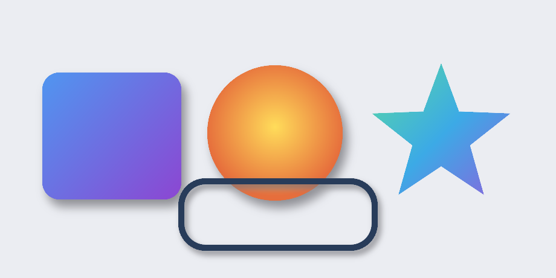

# WhatsCanvas

**A lightweight, embeddable, verifiable C++17 2D Canvas renderer.**

WhatsCanvas sits between heavyweight engines like Skia and minimal drawing
layers like NanoVG: lighter and easier to embed and read than the former, more
complete than the latter. It exposes a familiar `Canvas` / `Paint` / `Path` /
`Image` / `FontFace` API and runs on **four selectable backends** — desktop
OpenGL, OpenGL ES, a pure-CPU software rasterizer (no GPU at all), and an
optional Vulkan backend.



## First pixel in 60 seconds

The software backend needs no window, GL context, or GPU:

```cpp
#include <wsc/wsc.h>

int main()
{
    auto canvas = wsc::Canvas::create(wsc::Canvas::Backend::Software, 256, 256);   // sized; beginFrame initializes
    canvas->beginFrame();

    wsc::Paint fill;
    fill.setColor(wsc::Color(40, 120, 240, 255));
    fill.setAntiAlias(true);
    canvas->drawRoundRect(wsc::RectF(40, 40, 176, 176), 24.0f, fill);

    canvas->endFrame();
    canvas->savePixelsPPM("first.ppm");
    return 0;
}
```

Add it to your build:

```cmake
find_package(WhatsCanvas 0.1.16 CONFIG REQUIRED)
target_link_libraries(MyApp PRIVATE WhatsCanvas::OpenGL)   # or ::Software / ::OpenGLES
```

➡️ **[Get Started](GETTING_STARTED_AS_LIBRARY.md)** covers backend selection,
windowed OpenGL, GitHub Release consumption, Vulkan, and common tasks.

## Pick a backend

| Backend | Create with | Needs a GL context / window? | Use when |
| --- | --- | --- | --- |
| **Software (CPU)** | `Canvas::create(Backend::Software, w, h)` | No | Headless, servers, tests, thumbnails |
| **OpenGL** | `Canvas::create(Backend::OpenGL, w, h)` + `loadOpenGL(...)` | Yes (you own it) | Desktop apps/games with a window |
| **OpenGL ES** | `Canvas::create(Backend::OpenGLES, w, h)` + `loadOpenGL(...)` | Yes (you own it) | Mobile / embedded GLES 3.0 |
| **Vulkan** (optional) | `Canvas::create(Backend::Vulkan, w, h)` | No external GL context; off-screen by default | Vulkan pipelines, or Win32 `ToWindow`; degrades gracefully |

## What makes it stand out

- **A near-Skia text stack** — real HarfBuzz shaping, multi-font fallback
  segmentation, full Unicode UAX #9 bidi (861,948 conformance cases, 0
  failures), COLR/CPAL color glyphs, and a GPU glyph atlas — capabilities peer
  lightweight libraries usually leave to the application. See
  [Text & Fonts](TEXT_FEATURE_MATRIX.md).
- **Render-quality depth** — resolution-independent analytic anti-aliasing,
  fragment-level multi-stop gradients, true separable-Gaussian
  [shadows](SHADOW_MODEL.md), and anti-aliased arbitrary-path clipping.
- **A verification culture** — deterministic pixel readback, golden-image
  regression (software backend), fuzzy PPM comparison, cross-platform CI, and an
  auto-generated, CI-checked [API Reference](API_REFERENCE.md).
- **Genuinely portable** — one Canvas API over OpenGL, OpenGL ES, a zero-GPU
  software rasterizer, and optional Vulkan.

## Architecture at a glance

The core (`canvas` / `text` / `command` / `render`) is backend-neutral; only the
device layer is backend-specific.


## Where next

- [Get Started](GETTING_STARTED_AS_LIBRARY.md) — integrate WhatsCanvas.
- [API Reference](API_REFERENCE.md) · [API Stability](API_STABILITY.md).
- [Performance Benchmarks](PERFORMANCE_BENCHMARKS.md) · [Memory Management](MEMORY_MANAGEMENT.md).
- [Text & Fonts](TEXT_FEATURE_MATRIX.md) · [Shadows](SHADOW_MODEL.md) · [Blend Modes](BLEND_MODE_AUDIT.md).
- [Vulkan Status](vulkan-backend-status.md) · [Shader Portability](SHADER_PORTABILITY.md) · [iOS Build Notes](IOS_BUILD_NOTES.md).
