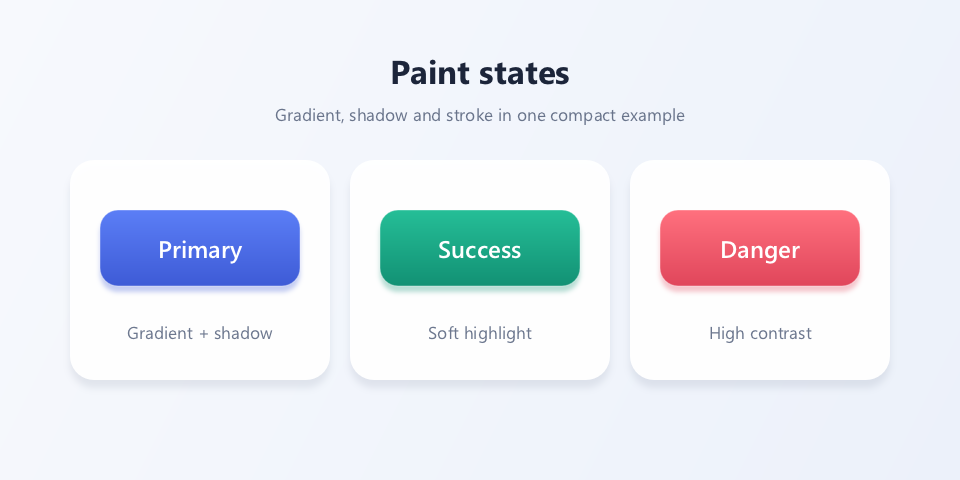

# Chapter 3: Paint in Depth

> Goal of this chapter: understand every attribute of `wsc::Paint` and learn to configure color, gradients, shadows, alpha, blend modes, sampling quality, and other drawing state.

For the Chinese version, see [`zh/03-paint-bindepth.md`](./zh/03-paint-bindepth.md).

---

## 3.1 The Paint Design Philosophy

`Paint` is a value-type object that describes "how to draw":

```cpp
wsc::Paint paint;  // Default state: black, fill, no anti-aliasing
```

It is not bound to any Canvas instance and can be created once and reused. Paint attributes fall into these categories:

| Category | Attributes |
|----------|-----------|
| Color | Solid color, linear gradient, radial gradient |
| Style | Fill, stroke, fill + stroke |
| Stroke | Width, cap, join |
| Effects | Shadow, blend mode, color matrix |
| Text | Text size, font family, weight, alignment, ... |
| Path effects | Dash, corner rounding |
| Image | Sampling quality, tile mode |

---

## 3.2 Color

### Basic Color

```cpp
wsc::Paint paint;

// Option 1: RGBA constructor (0–255)
paint.setColor(wsc::Color(255, 100, 50, 255));

// Option 2: predefined constants
paint.setColor(wsc::Color::WHITE);
paint.setColor(wsc::Color::BLACK);
paint.setColor(wsc::Color::RED);
paint.setColor(wsc::Color::GREEN);
paint.setColor(wsc::Color::BLUE);
```

### Alpha

```cpp
// Set alpha independently (0–255)
paint.setAlpha(128);  // 50% transparent

// Or specify it in the Color constructor
paint.setColor(wsc::Color(66, 133, 244, 180));  // A=180
```

---

## 3.3 Gradients

### Linear Gradient (Two Colors)

```cpp
wsc::Paint paint;
paint.setAntiAlias(true);

// setLinearGradient(x1, y1, x2, y2, startColor, endColor)
paint.setLinearGradient(
    0, 0,           // Start point
    200, 200,       // End point
    wsc::Color(66, 133, 244, 255),   // Start color: blue
    wsc::Color(15, 157, 88, 255)     // End color: green
);

canvas->drawRoundRect(wsc::RectF(50, 50, 200, 200), 20, paint);
```

### Linear Gradient (Multiple Color Stops)

```cpp
wsc::Paint paint;
paint.setAntiAlias(true);

// Use a ColorStop array to place multiple colors
paint.setLinearGradient(0, 0, 300, 0, {
    {0.0f, wsc::Color(255, 0, 0, 255)},     // Red
    {0.3f, wsc::Color(255, 165, 0, 255)},   // Orange
    {0.5f, wsc::Color(255, 255, 0, 255)},   // Yellow
    {0.7f, wsc::Color(0, 128, 0, 255)},     // Green
    {1.0f, wsc::Color(0, 0, 255, 255)},     // Blue
});

canvas->drawRect(wsc::RectF(20, 150, 360, 60), paint);
```

### Radial Gradient

```cpp
wsc::Paint paint;
paint.setAntiAlias(true);

// setRadialGradient(centerX, centerY, radius, innerColor, outerColor)
paint.setRadialGradient(
    200, 200,       // Center
    120,            // Radius
    wsc::Color(255, 255, 255, 255),  // Inner: white
    wsc::Color(33, 150, 243, 255)    // Outer: blue
);

canvas->drawCircle(200, 200, 120, paint);
```

---

## 3.4 Stroke Attributes

### Stroke Width

```cpp
wsc::Paint paint;
paint.setStyle(wsc::Paint::Style::STROKE);
paint.setStrokeWidth(5.0f);  // 5 pixels wide
paint.setColor(wsc::Color(33, 33, 33, 255));
```

### Line Cap (StrokeCap)

Controls the shape at the ends of line segments:

```cpp
// BUTT   — Butt cap, no extension past the endpoint (default)
paint.setStrokeCap(wsc::Paint::StrokeCap::BUTT);

// ROUND  — Round cap, extends by half the stroke width
paint.setStrokeCap(wsc::Paint::StrokeCap::ROUND);

// SQUARE — Square cap, extends by half the stroke width
paint.setStrokeCap(wsc::Paint::StrokeCap::SQUARE);
```

### Line Join (StrokeJoin)

Controls the shape at path corners:

```cpp
// MITER — Miter (default)
paint.setStrokeJoin(wsc::Paint::StrokeJoin::MITER);

// ROUND — Round
paint.setStrokeJoin(wsc::Paint::StrokeJoin::ROUND);

// BEVEL — Bevel
paint.setStrokeJoin(wsc::Paint::StrokeJoin::BEVEL);
```

---

## 3.5 Shadow

Paint-level shadows attach to every shape you draw:

```cpp
wsc::Paint paint;
paint.setColor(wsc::Color(66, 133, 244, 255));
paint.setAntiAlias(true);

// setShadowLayer(blurRadius, offsetX, offsetY, shadowColor)
paint.setShadowLayer(
    12.0f,                            // Blur radius
    4.0f,                             // X offset
    6.0f,                             // Y offset
    wsc::Color(0, 0, 0, 100)         // Shadow color
);

canvas->drawRoundRect(wsc::RectF(80, 80, 200, 150), 16, paint);
```

> **Note**: Paint shadow vs. `drawBoxShadow`
> - `setShadowLayer` applies to any shape (circle, path, ...)
> - `drawBoxShadow` only draws a rectangle / rounded rectangle shadow but can be used stand-alone

---

## 3.6 Blend Modes

Blend modes control how newly drawn content combines with existing content:

```cpp
paint.setBlendMode(wsc::Paint::BlendMode::SRC_OVER);  // Default: standard over
```

WhatsCanvas supports 14 blend modes:

| Mode | Effect |
|------|--------|
| `SRC_OVER` | Standard alpha compositing (default) |
| `SRC` | Fully replace the destination |
| `DST_OVER` | Draw below the destination |
| `SRC_IN` | Keep only where source overlaps destination |
| `DST_IN` | Keep only where destination overlaps source |
| `SRC_OUT` | Keep only where source does not overlap destination |
| `DST_OUT` | Remove destination where source overlaps |
| `SRC_ATOP` | Draw above destination but clipped to it |
| `DST_ATOP` | Destination visible only inside the source area |
| `XOR` | Keep only non-overlapping parts |
| `MULTIPLY` | Multiply colors (darken) |
| `SCREEN` | Invert, multiply, then invert (brighten) |
| `OVERLAY` | Combination of Multiply / Screen |
| `DARKEN` | Take the darker value |

### Example: Text as a Mask

```cpp
// Draw a gradient background first
wsc::Paint gradientBg;
gradientBg.setLinearGradient(0, 0, 400, 0,
    wsc::Color(255, 0, 128, 255), wsc::Color(0, 128, 255, 255));
canvas->drawRect(wsc::RectF(0, 0, 400, 200), gradientBg);

// Use DST_IN so subsequent drawing acts as a mask
wsc::Paint maskPaint;
maskPaint.setColor(wsc::Color(255, 255, 255, 255));
maskPaint.setBlendMode(wsc::Paint::BlendMode::DST_IN);
maskPaint.setTextSize(72.0f);
maskPaint.setFontFamily("Arial");
canvas->drawText("HELLO", 40, 130, maskPaint);
```

---

## 3.7 Anti-Aliasing

```cpp
wsc::Paint paint;

// On: smooth edges, best for slanted lines, curves, and circles
paint.setAntiAlias(true);

// Off: pixel-precise, best for pixel-aligned rectangles
paint.setAntiAlias(false);
```

**Best practice**:
- Always enable when drawing curves, slanted lines, and circles
- Disable for rectangles aligned to pixel boundaries to get sharper edges

---

## 3.8 Path Effects

### Dashed Lines

```cpp
wsc::Paint dashPaint;
dashPaint.setStyle(wsc::Paint::Style::STROKE);
dashPaint.setStrokeWidth(3.0f);
dashPaint.setColor(wsc::Color(33, 33, 33, 255));

// setDashPathEffect({segment length, gap length, ...}, phase)
dashPaint.setDashPathEffect({10.0f, 5.0f}, 0.0f);

canvas->drawLine(50, 100, 350, 100, dashPaint);
```

Complex dash patterns:

```cpp
// long-short-long-short pattern
dashPaint.setDashPathEffect({20.0f, 5.0f, 5.0f, 5.0f}, 0.0f);
```

### Corner Path Effect

Automatically rounds sharp path corners:

```cpp
wsc::Paint cornerPaint;
cornerPaint.setStyle(wsc::Paint::Style::STROKE);
cornerPaint.setStrokeWidth(3.0f);
cornerPaint.setCornerPathEffect(12.0f);  // 12px rounding radius
```

---

## 3.9 Image Sampling Quality

When drawing scaled images, the sampling quality balances visual result and performance:

```cpp
wsc::Paint imgPaint;

// NEAREST: nearest-neighbor, pixel-art style, fastest
imgPaint.setImageSampling(wsc::Paint::ImageSampling::NEAREST);

// LINEAR: bilinear interpolation, smooth (default)
imgPaint.setImageSampling(wsc::Paint::ImageSampling::LINEAR);

// MIPMAP_LINEAR: linear interpolation with mipmaps, best quality for downscaling
imgPaint.setImageSampling(wsc::Paint::ImageSampling::MIPMAP_LINEAR);
```

---

## 3.10 Image Tile Mode

```cpp
wsc::Paint tilePaint;

// CLAMP: extend edge pixels (default)
tilePaint.setImageTileMode(wsc::Paint::ImageTileMode::CLAMP);

// REPEAT: repeat / tile
tilePaint.setImageTileMode(wsc::Paint::ImageTileMode::REPEAT);

// MIRROR: mirrored repeat
tilePaint.setImageTileMode(wsc::Paint::ImageTileMode::MIRROR);
```

---

## 3.11 Color Matrix

The color matrix is a 4×5 float array that applies a linear transform to pixels:

```cpp
// Grayscale matrix
float grayscale[20] = {
    0.2126f, 0.7152f, 0.0722f, 0, 0,  // R
    0.2126f, 0.7152f, 0.0722f, 0, 0,  // G
    0.2126f, 0.7152f, 0.0722f, 0, 0,  // B
    0,       0,       0,       1, 0,  // A
};

wsc::Paint paint;
paint.setColorMatrix(grayscale);
```

---

## 3.12 Integrated Example: Gradient Buttons

{ width="480" }

The key point: the example outputs 960 × 480 physical pixels; with DPR 2 the drawing code uses a 480 × 240 logical coordinate space, and the doc renders the image at 480 pixels wide. Each button combines a linear gradient, a colored shadow, and a one-physical-pixel-wide highlight stroke. The code below matches the [compilable source](https://github.com/ClarkWain/WhatsCanvas/blob/main/examples/tutorials/chapter03_buttons.cpp) that produced the picture.

<!-- BEGIN GENERATED EXAMPLE: examples/tutorials/chapter03_buttons.cpp -->
```cpp
// Chapter 03 comprehensive example: gradient buttons and Paint states.
#include <wsc/FontSystem.h>
#include <wsc/wsc.h>

int main()
{
    // 1. Output 960x480 physical pixels using a 480x240 logical coordinate layout.
    // The doc renders the picture at 480 px wide, so DPR=2 preserves crisp edges.
    constexpr int kPhysicalWidth = 960;
    constexpr int kPhysicalHeight = 480;
    constexpr float kDpr = 2.0f;
    constexpr float kLogicalWidth = kPhysicalWidth / kDpr;
    constexpr float kLogicalHeight = kPhysicalHeight / kDpr;

    auto canvas = wsc::Canvas::create(
        wsc::Canvas::Backend::Software, kPhysicalWidth, kPhysicalHeight);
    if (!canvas) return 1;
    canvas->setDevicePixelRatio(kDpr);
    if (!canvas->initializeContext()) return 1;
    for (const auto &face : wsc::FontSystem::defaultSystemFontFaces()) canvas->registerFontFace(face);
    canvas->setFontFallbackChain(wsc::FontSystem::defaultFallbackChain());

    // 2. Draw the page background and title.
    canvas->beginFrame();
    wsc::Paint background;
    background.setLinearGradient(0, 0, kLogicalWidth, kLogicalHeight,
        wsc::Color(247, 249, 253, 255), wsc::Color(236, 241, 250, 255));
    canvas->drawRect(wsc::RectF(0, 0, kLogicalWidth, kLogicalHeight), background);

    wsc::Paint title;
    title.setColor(wsc::Color(28, 37, 58, 255));
    title.setTextSize(22.0f);
    title.setFontWeight(650);
    title.setTextAlign(wsc::Paint::TextAlign::CENTER);
    title.setTextBaseline(wsc::Paint::TextBaseline::MIDDLE);
    canvas->drawText("Paint states", kLogicalWidth / 2, 35, title);

    wsc::Paint subtitle = title;
    subtitle.setColor(wsc::Color(105, 116, 139, 255));
    subtitle.setTextSize(11.5f);
    subtitle.setFontWeight(400);
    canvas->drawText("Gradient, shadow and stroke in one compact example",
                     kLogicalWidth / 2, 57, subtitle);

    // 3. Describe three buttons as data; keep one copy of the drawing logic.
    struct Button {
        float x;
        wsc::Color top;
        wsc::Color bottom;
        const char *label;
        const char *caption;
    };
    const Button buttons[] = {
        {35, wsc::Color(91, 126, 246, 255), wsc::Color(62, 91, 214, 255), "Primary", "Gradient + shadow"},
        {175, wsc::Color(37, 190, 151, 255), wsc::Color(18, 145, 116, 255), "Success", "Soft highlight"},
        {315, wsc::Color(255, 112, 126, 255), wsc::Color(224, 70, 91, 255), "Danger", "High contrast"},
    };

    // 4. Draw the card, the button, and the caption one by one.
    for (const auto &button : buttons) {
        // White supporting card.
        const wsc::RectF card(button.x, 80, 130, 110);
        canvas->drawBoxShadow(card, 12, 0, 11, 0, 4, wsc::Color(35, 49, 83, 24));
        wsc::Paint cardPaint;
        cardPaint.setColor(wsc::Color(255, 255, 255, 245));
        cardPaint.setAntiAlias(true);
        canvas->drawRoundRect(card, 12, cardPaint);

        // Gradient button plus same-hue shadow.
        const wsc::RectF buttonRect(button.x + 15, 105, 100, 38);
        wsc::Paint fill;
        fill.setLinearGradient(button.x, 105, button.x, 143, button.top, button.bottom);
        fill.setAntiAlias(true);
        fill.setShadowLayer(7, 0, 3,
                            wsc::Color(button.bottom.getR(), button.bottom.getG(),
                                       button.bottom.getB(), 78));
        canvas->drawRoundRect(buttonRect, 9, fill);

        // 0.5 logical units maps to one physical pixel when DPR=2.
        wsc::Paint shine;
        shine.setStyle(wsc::Paint::Style::STROKE);
        shine.setStrokeWidth(0.5f);
        shine.setColor(wsc::Color(255, 255, 255, 92));
        shine.setAntiAlias(true);
        canvas->drawRoundRect(buttonRect, 9, shine);

        // Button label and Paint-feature caption.
        wsc::Paint label;
        label.setColor(wsc::Color(255, 255, 255, 255));
        label.setTextSize(16.0f);
        label.setFontWeight(600);
        label.setTextAlign(wsc::Paint::TextAlign::CENTER);
        label.setTextBaseline(wsc::Paint::TextBaseline::MIDDLE);
        canvas->drawText(button.label, button.x + 65, 124, label);

        wsc::Paint caption = label;
        caption.setColor(wsc::Color(108, 119, 142, 255));
        caption.setTextSize(11.5f);
        caption.setFontWeight(400);
        canvas->drawText(button.caption, button.x + 65, 166, caption);
    }

    // 5. End the frame first, then save the pixels; all drawing must happen before endFrame.
    canvas->endFrame();
    return canvas->savePixelsPPM("chapter03_buttons.ppm") ? 0 : 2;
}
```
<!-- END GENERATED EXAMPLE: examples/tutorials/chapter03_buttons.cpp -->

---

## 3.13 Summary

This chapter covered every Paint attribute category:

- [x] Color and alpha
- [x] Linear and radial gradients (with multi-stop support)
- [x] Stroke attributes: width, cap, join
- [x] Shadow layer (`setShadowLayer`)
- [x] The 14 blend modes
- [x] Anti-aliasing toggle
- [x] Path effects: dashes and rounded corners
- [x] Image sampling and tile modes
- [x] Color matrix transforms

**Next chapter**: [Path and Curves](./04-path-bindcurves.md) — build complex geometry and Bezier curves with Path.
