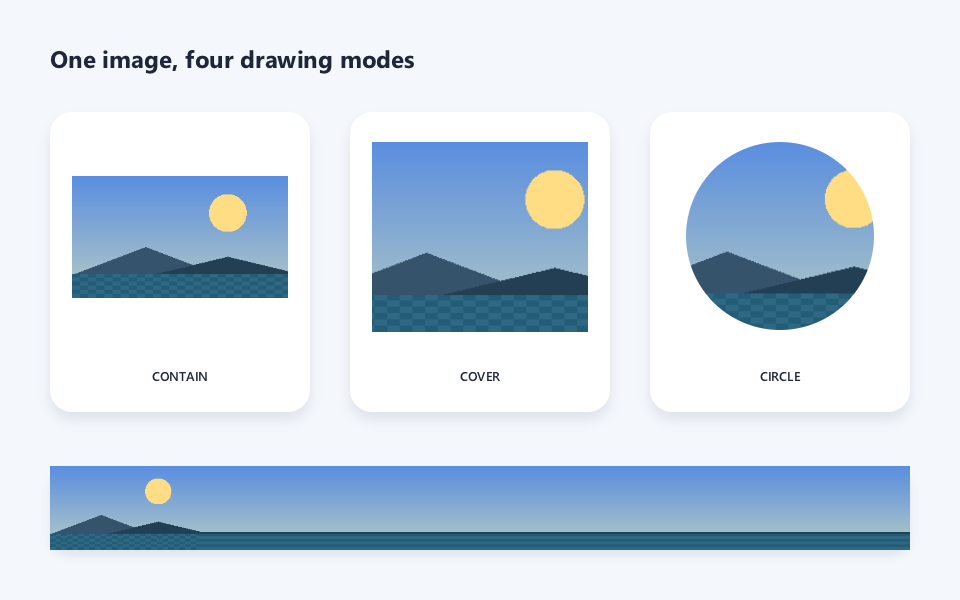

# Chapter 6: Image Drawing

> Goal of this chapter: learn how to load image assets, how to draw them with various options (fit, crop, rounded corners, nine-patch, tiling), and how to interoperate with external textures.

For the Chinese version, see [`zh/06-image-bindrawing.md`](./zh/06-image-bindrawing.md).

---

## 6.1 The Image Object

`wsc::Image` wraps a GPU texture resource. Its lifetime is bound to a Canvas — you need a Canvas reference to load it.

```cpp
wsc::Image image;  // Empty Image object

// After loading, image holds a GPU texture handle.
// When the Image is destroyed, the resource is released automatically.
```

**Note**: Image is non-copyable but movable:

```cpp
wsc::Image img1;
// img1 = img2;          // Compile error!
wsc::Image img2 = std::move(img1);  // OK
```

---

## 6.2 Loading Images

### From a File Path

```cpp
wsc::Image image;
bool ok = canvas->loadImage(image, "assets/photo.png");
if (!ok) {
    // Handle load failure
}
```

PNG and JPEG are supported.

### From Encoded Memory

When the image data is already in memory (from network download, an asset bundle, ...):

```cpp
// data is raw PNG/JPEG bytes
std::vector<unsigned char> pngData = loadFromNetwork("...");

wsc::Image image;
bool ok = canvas->loadImageFromEncodedMemory(
    image, pngData.data(), pngData.size(), true /*generateMipmaps*/);
```

### From Raw RGBA Pixels

```cpp
int w = 64, h = 64;
std::vector<unsigned char> pixels(w * h * 4, 255);  // All white

// Paint a red square
for (int y = 10; y < 50; ++y)
    for (int x = 10; x < 50; ++x) {
        int idx = (y * w + x) * 4;
        pixels[idx + 0] = 255;  // R
        pixels[idx + 1] = 0;    // G
        pixels[idx + 2] = 0;    // B
        pixels[idx + 3] = 255;  // A
    }

wsc::Image image;
canvas->loadImageFromRGBA(image, pixels.data(), w, h);
```

---

## 6.3 Basic Drawing

### At Native Size

```cpp
// Draw the image at its native size at position (x, y)
canvas->drawImage(image, 50.0f, 50.0f, paint);
```

### Scaled to a Region

```cpp
// Stretch the image into the target rectangle
canvas->drawImage(image, wsc::RectF(50, 50, 300, 200), paint);
```

### Source → Destination (partial draw)

```cpp
// Draw only the top-left quarter, scaled to fill the target
wsc::RectF src(0, 0, image.getWidth() / 2.0f, image.getHeight() / 2.0f);
wsc::RectF dst(50, 50, 300, 200);
canvas->drawImage(image, src, dst, paint);
```

---

## 6.4 Fit Modes (ImageFit)

Similar to CSS `object-fit`, controls how the image fits into the target region:

```cpp
wsc::RectF dst(50, 50, 300, 200);

// CONTAIN: show the whole image, may leave empty space
canvas->drawImageFit(image, dst, wsc::Canvas::ImageFit::CONTAIN, paint);

// COVER: fill the region, may crop edges
canvas->drawImageFit(image, dst, wsc::Canvas::ImageFit::COVER, paint);

// FILL: stretch to fill (default)
canvas->drawImageFit(image, dst, wsc::Canvas::ImageFit::FILL, paint);
```

### Anchor

For COVER, specify which region to preserve:

```cpp
// Preserve the top of the image (keep a portrait's head)
canvas->drawImageFit(image, dst, wsc::Canvas::ImageFit::COVER,
    wsc::Canvas::ImageAnchor::TOP, paint);

// Custom anchor (0–1, 0–1)
canvas->drawImageFit(image, dst, wsc::Canvas::ImageFit::COVER,
    0.5f, 0.3f, paint);  // Point of interest is above center
```

---

## 6.5 Rounded Images

### Uniform Corner Radius

```cpp
canvas->drawImageRounded(image, wsc::RectF(50, 50, 200, 200), 20.0f, paint);
```

### Per-Corner Radii

```cpp
canvas->drawImageRounded(image, wsc::RectF(50, 50, 200, 200),
    30.0f,  // Top-left
    10.0f,  // Top-right
    30.0f,  // Bottom-right
    10.0f,  // Bottom-left
    paint);
```

### Circular Image (Avatar)

```cpp
// Draw the image cropped to a circle
canvas->drawImageCircle(image, wsc::PointF(150, 150), 60.0f, paint);
```

---

## 6.6 Nine-Patch

Nine-patch is used for stretchable UI elements (button backgrounds, dialog bubbles, ...). The four corners stay at native size, the edges stretch, and the center tiles.

```cpp
// centerSrc: the stretchable center region in source coordinates
wsc::RectF centerSrc(20, 20, 60, 60);  // Assuming a 100x100 image with 20px insets

// dst: the target drawing region
wsc::RectF dst(50, 50, 300, 100);

canvas->drawImageNinePatch(image, centerSrc, dst, paint);
```

---

## 6.7 Tiling

Repeat the image to fill the target region (similar to CSS `background-repeat`):

```cpp
// Tile at native size
canvas->drawImageTiled(image, wsc::RectF(0, 0, 400, 400), paint);

// Specify tile size
canvas->drawImageTiled(image, wsc::RectF(0, 0, 400, 400),
    64.0f, 64.0f, paint);  // 64x64 tiles
```

---

## 6.8 Image Updates

### Replace All Pixels

```cpp
// Replace the entire content (size may change)
std::vector<unsigned char> newPixels = generateFrame();
canvas->replaceImageRGBA(image, newPixels.data(), newW, newH);
```

### Partial Update

Update only a rectangular sub-region (for video frames or dynamic textures):

```cpp
// Update a 32x32 region at (10, 10)
canvas->updateImageRGBA(image, subPixels.data(), 10, 10, 32, 32);
```

---

## 6.9 External Texture Interop

### OpenGL Texture

If you already have an OpenGL texture, let WhatsCanvas draw it directly:

```cpp
GLuint texId = ...; // Externally created OpenGL texture
int texW = 512, texH = 512;

wsc::Image image;
canvas->wrapExternalTexture(image, texId, texW, texH);
canvas->drawImage(image, wsc::RectF(0, 0, 400, 400), paint);
```

### Metal Texture

```cpp
id<MTLTexture> mtlTex = ...;
wsc::Image image;
canvas->wrapExternalMetalTexture(image, (__bridge void*)mtlTex, w, h);
```

---

## 6.10 Image Sampling Configuration

Control image sampling and filtering through the Paint:

```cpp
wsc::Paint imgPaint;

// Sampling quality when scaling
imgPaint.setImageSampling(wsc::Paint::ImageSampling::LINEAR);       // Default
imgPaint.setImageSampling(wsc::Paint::ImageSampling::NEAREST);      // Pixel-art style
imgPaint.setImageSampling(wsc::Paint::ImageSampling::MIPMAP_LINEAR);// Best for downscaling

// Behavior outside the image bounds
imgPaint.setImageTileMode(wsc::Paint::ImageTileMode::CLAMP);    // Extend edge pixels
imgPaint.setImageTileMode(wsc::Paint::ImageTileMode::REPEAT);   // Repeat
imgPaint.setImageTileMode(wsc::Paint::ImageTileMode::MIRROR);   // Mirror
imgPaint.setImageTileMode(wsc::Paint::ImageTileMode::DECAL);    // Transparent
```

---

## 6.11 Integrated Example: Image Gallery



The example uses `loadImageFromRGBA` to synthesize a test image in memory, so the tutorial does not depend on external assets. The code below matches the [compilable source](https://github.com/ClarkWain/WhatsCanvas/blob/main/examples/tutorials/chapter06_gallery.cpp) that produced the picture.

<!-- BEGIN GENERATED EXAMPLE: examples/tutorials/chapter06_gallery.cpp -->
```cpp
// Chapter 06 comprehensive example: image fit, circular crop and tiling.
#include <wsc/FontSystem.h>
#include <wsc/wsc.h>

#include <cmath>
#include <vector>

namespace {

std::vector<unsigned char> makeLandscape(int width, int height)
{
    // Generate an RGBA test picture in memory so the tutorial does not depend on external assets.
    std::vector<unsigned char> pixels(static_cast<std::size_t>(width) * height * 4u);
    for (int y = 0; y < height; ++y) {
        for (int x = 0; x < width; ++x) {
            const float fy = static_cast<float>(y) / height;
            unsigned char r = static_cast<unsigned char>(90 + 92 * fy);
            unsigned char g = static_cast<unsigned char>(142 + 62 * fy);
            unsigned char b = static_cast<unsigned char>(224 - 28 * fy);
            // Sun in the sky.
            const float sunDx = x - width * 0.72f;
            const float sunDy = y - height * 0.30f;
            if (sunDx * sunDx + sunDy * sunDy < 28.0f * 28.0f) {
                r = 255; g = 221; b = 132;
            }
            // Two mountain ridges and a water region at the bottom.
            const float ridgeA = height * 0.58f + std::abs(x - width * 0.34f) * 0.38f;
            const float ridgeB = height * 0.66f + std::abs(x - width * 0.72f) * 0.24f;
            if (y > ridgeA) { r = 54; g = 83; b = 108; }
            if (y > ridgeB) { r = 35; g = 63; b = 83; }
            if (y > height * 0.80f) {
                const int shimmer = ((x / 12 + y / 6) % 2) * 12;
                r = static_cast<unsigned char>(35 + shimmer);
                g = static_cast<unsigned char>(92 + shimmer);
                b = static_cast<unsigned char>(118 + shimmer);
            }
            const std::size_t index = (static_cast<std::size_t>(y) * width + x) * 4u;
            pixels[index] = r; pixels[index + 1] = g; pixels[index + 2] = b; pixels[index + 3] = 255;
        }
    }
    return pixels;
}

} // namespace

int main()
{
    // 1. Create the canvas and register the system fonts used for the title and labels.
    auto canvas = wsc::Canvas::create(wsc::Canvas::Backend::Software, 960, 600);
    if (!canvas || !canvas->initializeContext()) return 1;
    for (const auto &face : wsc::FontSystem::defaultSystemFontFaces()) {
        canvas->registerFontFace(face);
    }
    canvas->setFontFallbackChain(wsc::FontSystem::defaultFallbackChain());

    // 2. Upload the in-memory RGBA pixels as an Image.
    wsc::Image photo;
    const auto pixels = makeLandscape(320, 180);
    if (!canvas->loadImageFromRGBA(photo, pixels, 320, 180, true)) return 2;

    // 3. Draw the page background and title.
    canvas->beginFrame();
    wsc::Paint background;
    background.setColor(wsc::Color(244, 247, 252, 255));
    canvas->drawRect(wsc::RectF(0, 0, 960, 600), background);

    wsc::Paint title;
    title.setColor(wsc::Color(30, 39, 58, 255));
    title.setTextSize(32.0f);
    title.setFontWeight(650);
    title.setTextBaseline(wsc::Paint::TextBaseline::MIDDLE);
    canvas->drawText("One image, four drawing modes", 50, 58, title);

    wsc::Paint imagePaint;
    imagePaint.setColor(wsc::Color(255, 255, 255, 255));
    imagePaint.setAntiAlias(true);
    imagePaint.setImageSampling(wsc::Paint::ImageSampling::MIPMAP_LINEAR);

    // 4. Three white panels reuse the same layout helper.
    auto panel = [&](float x, const char *label) {
        const wsc::RectF bounds(x, 112, 260, 300);
        canvas->drawBoxShadow(bounds, 22, 0, 18, 0, 8, wsc::Color(35, 49, 83, 26));
        wsc::Paint surface;
        surface.setColor(wsc::Color(255, 255, 255, 255));
        surface.setAntiAlias(true);
        canvas->drawRoundRect(bounds, 22, surface);
        wsc::Paint caption = title;
        caption.setTextSize(17.0f);
        caption.setFontWeight(600);
        caption.setTextAlign(wsc::Paint::TextAlign::CENTER);
        canvas->drawText(label, x + 130, 376, caption);
    };

    panel(50, "CONTAIN");
    panel(350, "COVER");
    panel(650, "CIRCLE");

    // 5. Show the same image in CONTAIN, COVER, and circular crop.
    canvas->drawImageFit(photo, wsc::RectF(72, 142, 216, 190), wsc::Canvas::ImageFit::CONTAIN, imagePaint);
    canvas->drawImageFit(photo, wsc::RectF(372, 142, 216, 190), wsc::Canvas::ImageFit::COVER, imagePaint);
    canvas->drawImageCircle(photo, wsc::PointF(780, 236), 94, imagePaint);

    // 6. The bottom region demonstrates tiling with an explicit tile size.
    const wsc::RectF tiledBounds(50, 466, 860, 84);
    canvas->drawBoxShadow(tiledBounds, 18, 0, 14, 0, 6, wsc::Color(35, 49, 83, 24));
    canvas->drawImageTiled(photo, tiledBounds, 150, 84, imagePaint);

    // 7. Emit the picture that matches the tutorial image.
    canvas->endFrame();
    return canvas->savePixelsPPM("chapter06_gallery.ppm") ? 0 : 3;
}
```
<!-- END GENERATED EXAMPLE: examples/tutorials/chapter06_gallery.cpp -->

---

## 6.12 API Cheat Sheet

| Method | Description |
|--------|-------------|
| `loadImage(img, path)` | Load PNG/JPEG from a file |
| `loadImageFromEncodedMemory(...)` | Load from an encoded memory buffer |
| `loadImageFromRGBA(...)` | Load from raw RGBA pixels |
| `drawImage(img, x, y, paint)` | Draw at native size |
| `drawImage(img, dst, paint)` | Stretch to a region |
| `drawImage(img, src, dst, paint)` | Map a source region to a destination |
| `drawImageFit(img, dst, fit, paint)` | CONTAIN / COVER / FILL |
| `drawImageRounded(img, dst, r, paint)` | Rounded image |
| `drawImageCircle(img, center, r, paint)` | Circular image |
| `drawImageNinePatch(img, src, dst, paint)` | Nine-patch stretch |
| `drawImageTiled(img, dst, paint)` | Tile |
| `replaceImageRGBA(...)` | Replace all pixels |
| `updateImageRGBA(...)` | Partial pixel update |
| `wrapExternalTexture(...)` | Wrap an OpenGL texture |

---

## 6.13 Summary

This chapter covered:

- [x] Image object creation and lifetime
- [x] Three loading paths (file / encoded memory / raw pixels)
- [x] Basic drawing and region mapping
- [x] ImageFit modes and anchor
- [x] Rounded and circular images
- [x] Nine-patch stretch
- [x] Tiling
- [x] Dynamic pixel updates
- [x] External texture interop
- [x] Sampling and tile configuration

**Next chapter**: [Text Layout](./07-text-bindlayout.md) — font registration, text drawing, multi-line layout, and text on path.
