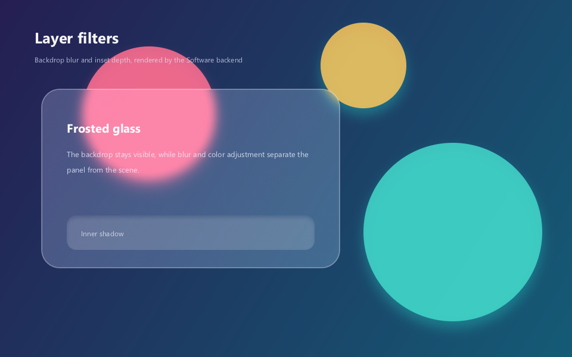

# 第八章：图层滤镜与特效

> 本章目标：掌握 WhatsCanvas 的图层系统和滤镜 API，学会实现模糊、内阴影、毛玻璃（frosted glass）、颜色调整和滤镜链等高级视觉效果。

---

## 8.1 图层系统基础

WhatsCanvas 的图层滤镜建立在 `saveLayer` 机制之上：

```
canvas->saveLayer(bounds, paint, options)
    → 绘制图层内容
canvas->restore()
    → 对整个图层应用滤镜后合成到父层
```

`LayerOptions` 提供两个关键属性：
- **imageFilter** —— 对图层**内容**应用滤镜（content filter）
- **backdropFilter** —— 对图层**底下的已有内容**应用滤镜（backdrop filter）

---

## 8.2 内容模糊 (Content Blur)

对图层内绘制的内容进行高斯模糊：

```cpp
wsc::Paint layerPaint;
layerPaint.setAlpha(255);

// 创建模糊滤镜
auto blur = wsc::ImageFilter::blur(8.0f);

// 应用到图层
canvas->saveLayer(wsc::RectF(50, 50, 300, 200), layerPaint,
    wsc::LayerOptions().setImageFilter(blur));

// 在图层内绘制内容（这些内容会被模糊）
wsc::Paint textPaint;
textPaint.setTextSize(24.0f);
textPaint.setColor(wsc::Color(33, 33, 33, 255));
canvas->drawText("This text will be blurred", 70, 130, textPaint);

canvas->restore();  // 模糊效果在此生效
```

### 参数说明

```cpp
// 统一半径
ImageFilter::blur(12.0f);

// X/Y 方向独立半径
ImageFilter::blur(16.0f, 4.0f);  // 水平模糊强，垂直模糊弱

// 使用 sigma 值（物理高斯参数）
ImageFilter::blurSigma(4.0f);

// TileMode: 边缘像素的处理方式
ImageFilter::blur(8.0f, ImageFilter::TileMode::Clamp);  // 边缘延伸（默认）
ImageFilter::blur(8.0f, ImageFilter::TileMode::Decal);  // 边缘透明
```

> **radius vs sigma**: `radius ≈ sigma × 3`。大多数情况使用 `blur(radius)` 更直观。最大模糊半径为 64px。

---

## 8.3 背景模糊 (Backdrop Blur)

对图层底下的已有内容进行模糊——实现类似 iOS 通知中心的效果：

```cpp
// 先绘制背景内容（图片、文字等）
canvas->drawImage(backgroundImage, 0, 0, wsc::Paint());

// 创建一个背景模糊图层
auto backdropBlur = wsc::ImageFilter::blur(12.0f);

canvas->saveLayer(wsc::RectF(50, 100, 300, 150), wsc::Paint(),
    wsc::LayerOptions().setBackdropFilter(backdropBlur));

// 在模糊背景上绘制前景
wsc::Paint cardBg;
cardBg.setColor(wsc::Color(255, 255, 255, 180));  // 半透明白
canvas->drawRoundRect(wsc::RectF(50, 100, 300, 150), 16.0f, cardBg);

wsc::Paint text;
text.setTextSize(18.0f);
text.setColor(wsc::Color(33, 33, 33, 255));
canvas->drawText("Card with backdrop blur", 70, 180, text);

canvas->restore();
```

---

## 8.4 毛玻璃效果 (Frosted Glass)

`frostedGlass` 是 WhatsCanvas 的高级复合滤镜，一次调用实现完整的毛玻璃效果：

```cpp
auto frosted = wsc::ImageFilter::frostedGlass(
    8.0f,    // blurSigma — 模糊强度
    1.18f,   // saturation — 饱和度增强
    1.04f,   // brightness — 亮度微调
    1.02f,   // contrast — 对比度微调
    0.012f   // grain — 颗粒感（模拟玻璃质感）
);

// 作为背景滤镜使用
canvas->saveLayer(bounds, wsc::Paint(),
    wsc::LayerOptions().setBackdropFilter(frosted));

// 绘制半透明遮罩
wsc::Paint glass;
glass.setColor(wsc::Color(255, 255, 255, 40));
canvas->drawRoundRect(bounds, 20.0f, glass);

canvas->restore();
```

### 参数调节指南

| 参数 | 典型值 | 效果 |
|------|-------|------|
| `blurSigma` | 6~16 | 越大越模糊 |
| `saturation` | 1.0~1.4 | >1 增加色彩鲜艳度 |
| `brightness` | 0.9~1.1 | >1 提亮，<1 变暗 |
| `contrast` | 0.9~1.1 | >1 增加对比 |
| `grain` | 0.005~0.02 | 添加噪点质感 |

---

## 8.5 内阴影 (Inner Shadow)

在形状内部绘制阴影效果（类似 CSS `box-shadow: inset`）：

```cpp
auto innerShadow = wsc::ImageFilter::innerShadow(
    8.0f,                           // 模糊半径
    2.0f, 4.0f,                     // X/Y 偏移
    wsc::Color(0, 0, 0, 128)       // 阴影颜色
);

canvas->saveLayer(bounds, wsc::Paint(),
    wsc::LayerOptions().setImageFilter(innerShadow));

// 绘制形状（内阴影会出现在形状内部边缘）
wsc::Paint shapePaint;
shapePaint.setColor(wsc::Color(240, 240, 240, 255));
canvas->drawRoundRect(bounds, 16.0f, shapePaint);

canvas->restore();
```

### 变体

```cpp
// 统一半径
ImageFilter::innerShadow(8.0f, 2.0f, 4.0f, shadowColor);

// X/Y 方向独立半径
ImageFilter::innerShadow(12.0f, 6.0f, 2.0f, 4.0f, shadowColor);

// 使用 sigma 参数
ImageFilter::innerShadowSigma(3.0f, 2.0f, 4.0f, shadowColor);
```

---

## 8.6 颜色调整

### 通过滤镜调整

`ImageFilter` 支持附加颜色调整：

```cpp
auto filter = wsc::ImageFilter::blur(4.0f);
filter.setColorAdjustment(
    1.3f,   // saturation — 饱和度
    1.1f,   // brightness — 亮度
    1.05f   // contrast — 对比度
);
filter.setGrain(0.01f);  // 颗粒感
```

### 通过颜色矩阵

颜色矩阵可以对像素做任意线性变换（4x5 矩阵 = 20 个浮点数）：

```cpp
// 灰度化
std::array<float, 20> grayscale = {
    0.2126f, 0.7152f, 0.0722f, 0, 0,
    0.2126f, 0.7152f, 0.0722f, 0, 0,
    0.2126f, 0.7152f, 0.0722f, 0, 0,
    0,       0,       0,       1, 0,
};

// 怀旧色调
std::array<float, 20> sepia = {
    0.393f, 0.769f, 0.189f, 0, 0,
    0.349f, 0.686f, 0.168f, 0, 0,
    0.272f, 0.534f, 0.131f, 0, 0,
    0,      0,      0,      1, 0,
};

// 反色
std::array<float, 20> invert = {
    -1, 0,  0,  0, 255,
    0,  -1, 0,  0, 255,
    0,  0,  -1, 0, 255,
    0,  0,  0,  1, 0,
};
```

---

## 8.7 滤镜链 (ImageFilterChain)

多个滤镜可以串联执行（最多 8 个节点）：

```cpp
wsc::ImageFilterChain chain;

// 先模糊
chain.append(wsc::ImageFilter::blur(6.0f));

// 再应用颜色矩阵（比如降低饱和度）
std::array<float, 20> desaturate = {
    0.5f, 0.5f, 0.0f, 0, 0,
    0.2f, 0.7f, 0.1f, 0, 0,
    0.1f, 0.3f, 0.6f, 0, 0,
    0,    0,    0,    1, 0,
};
chain.appendColorMatrix(desaturate);

// 最后添加偏移
chain.appendOffset(4.0f, 4.0f);

// 应用到图层
canvas->saveLayer(bounds, wsc::Paint(),
    wsc::LayerOptions().setImageFilter(chain));
// ... 绘制 ...
canvas->restore();
```

### 滤镜链也可以用于 backdrop

```cpp
wsc::ImageFilterChain backdropChain;
backdropChain.append(wsc::ImageFilter::blur(10.0f));
backdropChain.appendColorMatrix(warmTintMatrix);

canvas->saveLayer(bounds, wsc::Paint(),
    wsc::LayerOptions().setBackdropFilter(backdropChain));
```

---

## 8.8 同时使用 Content 和 Backdrop 滤镜

```cpp
auto backdropFrosted = wsc::ImageFilter::frostedGlass(8.0f);
auto contentShadow = wsc::ImageFilter::innerShadow(6, 0, 2, wsc::Color(0,0,0,80));

wsc::LayerOptions opts;
opts.setBackdropFilter(backdropFrosted);  // 背景毛玻璃
opts.setImageFilter(contentShadow);        // 内容内阴影

canvas->saveLayer(bounds, wsc::Paint(), opts);

// 绘制前景内容
wsc::Paint card;
card.setColor(wsc::Color(255, 255, 255, 60));
canvas->drawRoundRect(bounds, 20.0f, card);

canvas->restore();
```

---

## 8.9 综合示例：iOS 风格通知面板



效果重点：彩色圆形先绘制到背景，`backdropFilter` 只处理面板后方的像素；输入框使用 `innerShadow` 产生内凹深度。下方代码与生成图片的[可编译源码](https://github.com/ClarkWain/WhatsCanvas/blob/main/examples/tutorials/chapter08_filters.cpp)相同。

<!-- BEGIN GENERATED EXAMPLE: examples/tutorials/chapter08_filters.cpp -->
```cpp
// Chapter 08 comprehensive example: frosted glass and inner shadow.
#include <wsc/FontSystem.h>
#include <wsc/wsc.h>

int main()
{
    // 1. 创建画布并注册界面文字使用的系统字体。
    auto canvas = wsc::Canvas::create(wsc::Canvas::Backend::Software, 960, 600);
    if (!canvas || !canvas->initializeContext()) return 1;
    for (const auto &face : wsc::FontSystem::defaultSystemFontFaces()) {
        canvas->registerFontFace(face);
    }
    canvas->setFontFallbackChain(wsc::FontSystem::defaultFallbackChain());

    // 2. 先绘制渐变背景和三个彩色圆；它们是毛玻璃的输入背景。
    canvas->beginFrame();
    wsc::Paint background;
    background.setLinearGradient(0, 0, 960, 600,
        wsc::Color(37, 30, 82, 255), wsc::Color(20, 91, 118, 255));
    canvas->drawRect(wsc::RectF(0, 0, 960, 600), background);

    wsc::Paint orb;
    orb.setAntiAlias(true);
    orb.setColor(wsc::Color(255, 111, 145, 220));
    orb.setShadowLayer(28, 0, 12, wsc::Color(255, 95, 142, 95));
    canvas->drawCircle(250, 190, 112, orb);
    orb.setColor(wsc::Color(66, 215, 202, 220));
    orb.setShadowLayer(30, 0, 12, wsc::Color(39, 210, 196, 90));
    canvas->drawCircle(760, 390, 150, orb);
    orb.setColor(wsc::Color(254, 199, 90, 215));
    canvas->drawCircle(610, 110, 72, orb);

    // 3. 绘制页面标题。
    wsc::Paint title;
    title.setColor(wsc::Color(255, 255, 255, 245));
    title.setTextSize(34.0f);
    title.setFontWeight(650);
    title.setTextBaseline(wsc::Paint::TextBaseline::MIDDLE);
    canvas->drawText("Layer filters", 58, 62, title);
    title.setTextSize(16.0f);
    title.setFontWeight(400);
    title.setColor(wsc::Color(225, 232, 249, 190));
    canvas->drawText("Backdrop blur and inset depth, rendered by the Software backend", 58, 100, title);

    // 4. backdropFilter 处理面板后方已经绘制的像素。
    const wsc::RectF glassBounds(70, 150, 500, 300);
    wsc::Paint composite;
    composite.setColor(wsc::Color(255, 255, 255, 255));
    wsc::LayerOptions glass;
    glass.setBackdropFilter(wsc::ImageFilter::frostedGlass(8.0f, 1.16f, 1.04f, 1.02f, 0.004f));

    // saveLayer 的边界是矩形；先使用同尺寸的圆角路径裁剪，避免右上角等位置
    // 泄漏矩形的 backdropFilter 结果。
    canvas->save();
    wsc::Path glassClip;
    glassClip.addRoundRect(glassBounds, 30.0f);
    canvas->clipPath(glassClip);
    canvas->saveLayer(glassBounds, composite, glass);
    wsc::Paint tint;
    tint.setColor(wsc::Color(239, 246, 255, 54));
    tint.setAntiAlias(true);
    canvas->drawRoundRect(glassBounds, 30, tint);
    canvas->restore(); // 合成毛玻璃图层。
    canvas->restore(); // 解除圆角裁剪。

    wsc::Paint border;
    border.setStyle(wsc::Paint::Style::STROKE);
    border.setStrokeWidth(1.5f);
    border.setColor(wsc::Color(255, 255, 255, 105));
    border.setAntiAlias(true);
    canvas->drawRoundRect(glassBounds, 30, border);

    // 5. 面板内容在 restore 之后绘制，因此文字本身不会被模糊。
    wsc::Paint glassTitle = title;
    glassTitle.setColor(wsc::Color(255, 255, 255, 250));
    glassTitle.setTextSize(27.0f);
    glassTitle.setFontWeight(650);
    canvas->drawText("Frosted glass", 112, 215, glassTitle);
    glassTitle.setTextSize(17.0f);
    glassTitle.setFontWeight(400);
    glassTitle.setColor(wsc::Color(239, 244, 255, 205));
    glassTitle.setTextBaseline(wsc::Paint::TextBaseline::TOP);
    canvas->drawTextBox("The backdrop stays visible, while blur and color adjustment separate the panel from the scene.",
                        wsc::RectF(112, 250, 410, 100), 26.0f, 3, true, glassTitle);

    // 6. imageFilter 只处理当前图层内容，用于实现输入框内阴影。
    const wsc::RectF fieldBounds(112, 362, 416, 58);
    wsc::LayerOptions inset;
    inset.setImageFilter(wsc::ImageFilter::innerShadow(8.0f, 0, 4, wsc::Color(13, 23, 50, 125)));
    canvas->saveLayer(fieldBounds, composite, inset);
    wsc::Paint field;
    field.setColor(wsc::Color(255, 255, 255, 42));
    field.setAntiAlias(true);
    canvas->drawRoundRect(fieldBounds, 16, field);
    canvas->restore();
    glassTitle.setTextSize(16.0f);
    glassTitle.setColor(wsc::Color(255, 255, 255, 175));
    glassTitle.setTextBaseline(wsc::Paint::TextBaseline::MIDDLE);
    canvas->drawText("Inner shadow", 136, 392, glassTitle);

    // 7. 提交并保存滤镜效果图。
    canvas->endFrame();
    return canvas->savePixelsPPM("chapter08_filters.ppm") ? 0 : 2;
}
```
<!-- END GENERATED EXAMPLE: examples/tutorials/chapter08_filters.cpp -->

---

## 8.10 性能注意事项

图层滤镜涉及 GPU 额外的渲染 pass，使用时注意：

| 建议 | 原因 |
|------|------|
| 限制滤镜区域大小 | 模糊的计算量与面积成正比 |
| 避免过深的图层嵌套 | 每层 saveLayer 都分配离屏 buffer |
| 控制模糊半径 | 最大 64px，超大半径性能下降显著 |
| 静态内容考虑 Picture 缓存 | `drawPictureRasterized` 避免每帧重算滤镜 |
| backdrop filter 比 content filter 更昂贵 | 需要读取并处理已渲染内容 |

---

## 8.11 API 速查表

| API | 说明 |
|-----|------|
| `ImageFilter::blur(r)` | 高斯模糊 |
| `ImageFilter::blur(rx, ry)` | XY 独立模糊 |
| `ImageFilter::blurSigma(s)` | sigma 参数模糊 |
| `ImageFilter::innerShadow(r, dx, dy, color)` | 内阴影 |
| `ImageFilter::frostedGlass(blur, sat, brt, ctr, grain)` | 毛玻璃 |
| `filter.setColorAdjustment(sat, brt, ctr)` | 颜色调整 |
| `filter.setGrain(amount)` | 颗粒感 |
| `ImageFilterChain::append(filter)` | 添加滤镜节点 |
| `ImageFilterChain::appendColorMatrix(m)` | 添加颜色矩阵 |
| `ImageFilterChain::appendOffset(dx, dy)` | 添加偏移 |
| `LayerOptions::setImageFilter(f)` | 设置内容滤镜 |
| `LayerOptions::setBackdropFilter(f)` | 设置背景滤镜 |

---

## 8.12 小结

本章学习了：

- [x] 图层系统（saveLayer + LayerOptions）
- [x] 内容模糊和背景模糊
- [x] 毛玻璃效果（frostedGlass）
- [x] 内阴影
- [x] 颜色矩阵变换
- [x] 滤镜链（ImageFilterChain）
- [x] 同时使用 content 和 backdrop 滤镜
- [x] 性能注意事项

**下一章**：[窗口呈现与交互](./09-windowed-presentation.md) —— 学习如何将渲染结果显示到窗口并处理用户输入。
