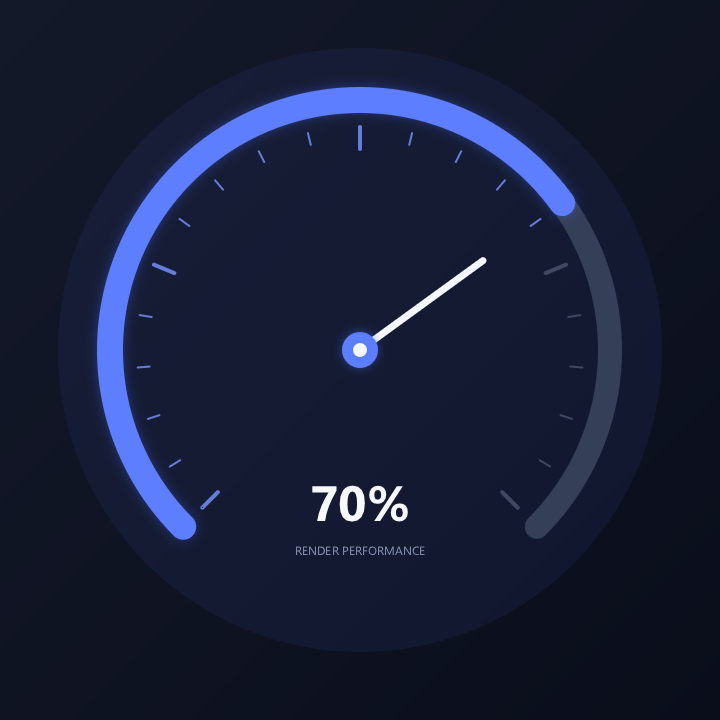

# 第四章：路径 Path 与曲线

> 本章目标：掌握 `wsc::Path` 的使用方法，学会构造复杂几何形状、贝塞尔曲线，以及路径的查询、变换和 hit-testing。

---

## 4.1 什么是 Path

`Path` 是一个由多个子路径（contour）组成的 2D 几何描述。每个子路径由一系列"命令"组成：

```
moveTo → lineTo/quadTo/cubicTo → ... → close（可选）
```

Path 本身不包含颜色或宽度信息——它只描述"形状"，绘制时需要搭配 `Paint` 使用。

---

## 4.2 基础路径构造

### 三角形

```cpp
wsc::Path triangle;
triangle.moveTo(200, 50);    // 移动到起始点
triangle.lineTo(350, 300);   // 画线到第二个点
triangle.lineTo(50, 300);    // 画线到第三个点
triangle.close();             // 闭合路径（回到起点）

wsc::Paint paint;
paint.setColor(wsc::Color(255, 87, 34, 255));
paint.setAntiAlias(true);
canvas->drawPath(triangle, paint);
```

### 星形

```cpp
wsc::Path star;
float cx = 200, cy = 200, outerR = 100, innerR = 45;
int points = 5;

for (int i = 0; i < points * 2; ++i) {
    float angle = i * 3.14159265f / points - 3.14159265f / 2;
    float r = (i % 2 == 0) ? outerR : innerR;
    float x = cx + r * std::cos(angle);
    float y = cy + r * std::sin(angle);

    if (i == 0) star.moveTo(x, y);
    else        star.lineTo(x, y);
}
star.close();

wsc::Paint starPaint;
starPaint.setColor(wsc::Color(255, 193, 7, 255));
starPaint.setAntiAlias(true);
canvas->drawPath(star, starPaint);
```

---

## 4.3 曲线命令

### 二次贝塞尔曲线 (quadTo)

由一个控制点和一个终点定义的曲线：

```cpp
wsc::Path curve;
curve.moveTo(50, 200);
curve.quadTo(
    200, 50,    // 控制点：决定曲线弯曲方向
    350, 200    // 终点
);

wsc::Paint paint;
paint.setStyle(wsc::Paint::Style::STROKE);
paint.setStrokeWidth(3.0f);
paint.setAntiAlias(true);
paint.setColor(wsc::Color(33, 150, 243, 255));
canvas->drawPath(curve, paint);
```

### 三次贝塞尔曲线 (cubicTo)

由两个控制点和一个终点定义，能表达更复杂的曲线：

```cpp
wsc::Path cubic;
cubic.moveTo(50, 200);
cubic.cubicTo(
    100, 50,    // 控制点 1
    300, 350,   // 控制点 2
    350, 200    // 终点
);

wsc::Paint paint;
paint.setStyle(wsc::Paint::Style::STROKE);
paint.setStrokeWidth(3.0f);
paint.setAntiAlias(true);
paint.setColor(wsc::Color(156, 39, 176, 255));
canvas->drawPath(cubic, paint);
```

### 连续曲线

多个曲线命令可以连续调用，前一个命令的终点就是下一个命令的起点：

```cpp
wsc::Path wave;
wave.moveTo(0, 200);
wave.cubicTo(100, 100, 150, 300, 200, 200);
wave.cubicTo(250, 100, 300, 300, 400, 200);

wsc::Paint wavePaint;
wavePaint.setStyle(wsc::Paint::Style::STROKE);
wavePaint.setStrokeWidth(4.0f);
wavePaint.setAntiAlias(true);
wavePaint.setColor(wsc::Color(0, 150, 136, 255));
canvas->drawPath(wave, wavePaint);
```

---

## 4.4 形状辅助方法

Path 提供了常用形状的便捷方法，避免手动计算坐标：

```cpp
wsc::Path shapes;

// 添加矩形
shapes.addRect(wsc::RectF(20, 20, 100, 60));

// 添加圆角矩形
shapes.addRoundRect(wsc::RectF(20, 100, 100, 60), 12.0f);

// 四角独立圆角
shapes.addRoundRect(wsc::RectF(20, 180, 100, 60),
    20.0f, 0.0f, 20.0f, 0.0f);  // tl, tr, br, bl

// 添加圆
shapes.addCircle(200, 50, 40);

// 添加椭圆
shapes.addOval(wsc::RectF(160, 100, 100, 60));
```

---

## 4.5 填充规则

Path 的填充规则决定了路径围成的哪些区域被视为"内部"：

```cpp
wsc::Path donut;
donut.setFillType(wsc::Path::FillType::EVEN_ODD);

// 外圈
donut.addCircle(200, 200, 100);
// 内圈（制造空心效果）
donut.addCircle(200, 200, 50);

wsc::Paint paint;
paint.setColor(wsc::Color(233, 30, 99, 255));
paint.setAntiAlias(true);
canvas->drawPath(donut, paint);
```

| 填充规则 | 效果 |
|---------|------|
| `WINDING`（默认） | 根据绘制方向判断内外，同向叠加 |
| `EVEN_ODD` | 交叉次数为奇数的区域为内部（常用于空心效果） |

---

## 4.6 路径查询

### 包围盒

```cpp
wsc::Path path;
path.addCircle(150, 150, 80);

// 获取填充区域的轴对齐包围盒
wsc::RectF bounds = path.getBounds();
// bounds ≈ (70, 70, 160, 160)

// 获取描边后的包围盒
wsc::RectF strokeBounds = path.getStrokeBounds(4.0f);
```

### 路径长度与采样

```cpp
wsc::Path arc;
arc.moveTo(50, 200);
arc.cubicTo(100, 50, 300, 50, 350, 200);

// 获取路径总长度
float len = arc.length();

// 获取路径上某一距离处的点
wsc::PointF point;
arc.pointAtLength(len * 0.5f, point);  // 中点位置

// 获取点和切线方向
wsc::PointF tangent;
arc.pointAndTangentAtLength(len * 0.5f, point, tangent);
```

### 路径状态

```cpp
path.isEmpty();            // 是否没有任何命令
path.isClosed();           // 是否所有子路径都已闭合
path.getContourCount();    // 子路径数量
```

---

## 4.7 Hit-Testing（命中测试）

判断一个点是否在路径内部（或描边区域内），常用于交互事件处理：

```cpp
wsc::Path button;
button.addRoundRect(wsc::RectF(100, 100, 200, 60), 12.0f);

// 判断点击位置是否在填充区域内
float clickX = 150, clickY = 130;
bool hit = button.contains(clickX, clickY);  // true

// 判断是否在描边区域内（用于线条选择）
bool strokeHit = button.strokeContains(clickX, clickY, 4.0f);
```

---

## 4.8 路径变换

### 平移

```cpp
wsc::Path path;
path.addCircle(0, 0, 50);

// 整体平移
path.offset(200, 200);  // 现在圆心在 (200, 200)
```

### 裁剪 (trim)

截取路径的一段：

```cpp
wsc::Path fullPath;
fullPath.moveTo(50, 200);
fullPath.cubicTo(100, 50, 300, 50, 350, 200);

// 截取从 30% 到 70% 的部分
wsc::Path trimmed = fullPath.trim(
    fullPath.length() * 0.3f,
    fullPath.length() * 0.7f
);

canvas->drawPath(trimmed, paint);
```

### 反转

```cpp
// 反转路径方向（影响填充规则和文字方向）
wsc::Path reversed = path.reversed();
```

### 圆角化

将路径中的尖角变为圆角：

```cpp
wsc::Path sharp;
sharp.moveTo(50, 300);
sharp.lineTo(200, 50);
sharp.lineTo(350, 300);
sharp.close();

// 将尖角替换为半径 20 的圆角
wsc::Path rounded = sharp.roundedCorners(20.0f);
canvas->drawPath(rounded, paint);
```

---

## 4.9 路径描边效果

### 虚线路径

```cpp
wsc::Paint dashStroke;
dashStroke.setStyle(wsc::Paint::Style::STROKE);
dashStroke.setStrokeWidth(3.0f);
dashStroke.setAntiAlias(true);
dashStroke.setColor(wsc::Color(33, 33, 33, 255));
dashStroke.setDashPathEffect({15.0f, 8.0f}, 0.0f);

wsc::Path circle;
circle.addCircle(200, 200, 100);
canvas->drawPath(circle, dashStroke);
```

### 动画虚线（通过 phase）

通过改变 `phase` 参数可以制造虚线流动的动画效果：

```cpp
float phase = frameCount * 2.0f;  // 每帧递增
dashStroke.setDashPathEffect({15.0f, 8.0f}, phase);
```

---

## 4.10 综合示例：仪表盘



效果重点：背景弧、进度弧、刻度和指针分别绘制，文字区域与指针区域保持独立，避免标签重叠。下方代码与生成图片的[可编译源码](https://github.com/ClarkWain/WhatsCanvas/blob/main/examples/tutorials/chapter04_gauge.cpp)相同。

<!-- BEGIN GENERATED EXAMPLE: examples/tutorials/chapter04_gauge.cpp -->
```cpp
// Chapter 04 comprehensive example: a readable gauge built with paths and arcs.
#include <wsc/FontSystem.h>
#include <wsc/wsc.h>

#include <cmath>

int main()
{
    // 1. 创建画布并准备文字渲染。
    auto canvas = wsc::Canvas::create(wsc::Canvas::Backend::Software, 720, 720);
    if (!canvas || !canvas->initializeContext()) return 1;
    for (const auto &face : wsc::FontSystem::defaultSystemFontFaces()) canvas->registerFontFace(face);
    canvas->setFontFallbackChain(wsc::FontSystem::defaultFallbackChain());

    constexpr float pi = 3.14159265f, cx = 360.0f, cy = 350.0f, radius = 250.0f;
    constexpr float progress = 0.70f, start = pi * 0.75f, sweep = pi * 1.5f;

    // 2. 绘制深色背景和仪表盘光晕。
    canvas->beginFrame();

    wsc::Paint background;
    background.setLinearGradient(0, 0, 720, 720,
        wsc::Color(20, 25, 42, 255), wsc::Color(10, 14, 27, 255));
    canvas->drawRect(wsc::RectF(0, 0, 720, 720), background);

    wsc::Paint halo;
    halo.setColor(wsc::Color(82, 113, 255, 18));
    halo.setAntiAlias(true);
    canvas->drawCircle(cx, cy, radius + 52, halo);

    // 3. 将 270 度量程等分成 20 段，每五格使用一个长刻度。
    wsc::Paint tick;
    tick.setStyle(wsc::Paint::Style::STROKE);
    tick.setStrokeCap(wsc::Paint::StrokeCap::ROUND);
    tick.setAntiAlias(true);
    for (int i = 0; i <= 20; ++i) {
        const float t = static_cast<float>(i) / 20.0f;
        const float angle = start + sweep * t;
        const float outer = radius - 27;
        const float inner = outer - (i % 5 == 0 ? 22.0f : 12.0f);
        tick.setStrokeWidth(i % 5 == 0 ? 4.0f : 2.0f);
        tick.setColor(i <= 14 ? wsc::Color(117, 145, 255, 210) : wsc::Color(82, 91, 116, 180));
        canvas->drawLine(cx + std::cos(angle) * inner, cy + std::sin(angle) * inner,
                         cx + std::cos(angle) * outer, cy + std::sin(angle) * outer, tick);
    }

    // 4. 先绘制完整轨道，再按 progress 覆盖前景进度弧。
    const wsc::RectF arcBounds(cx - radius, cy - radius, radius * 2, radius * 2);
    wsc::Paint track;
    track.setStyle(wsc::Paint::Style::STROKE);
    track.setStrokeWidth(24.0f);
    track.setStrokeCap(wsc::Paint::StrokeCap::ROUND);
    track.setColor(wsc::Color(54, 63, 88, 255));
    track.setAntiAlias(true);
    canvas->drawArc(arcBounds, start, sweep, wsc::Canvas::ArcMode::OPEN, track);

    wsc::Paint valueArc = track;
    valueArc.setStrokeWidth(26.0f);
    valueArc.setColor(wsc::Color(92, 126, 255, 255));
    valueArc.setShadowLayer(18, 0, 0, wsc::Color(74, 111, 255, 90));
    canvas->drawArc(arcBounds, start, sweep * progress, wsc::Canvas::ArcMode::OPEN, valueArc);

    // 5. 指针与进度弧使用相同角度公式，保证两者指向一致。
    const float angle = start + sweep * progress;
    wsc::Paint needle;
    needle.setStyle(wsc::Paint::Style::STROKE);
    needle.setStrokeWidth(7.0f);
    needle.setStrokeCap(wsc::Paint::StrokeCap::ROUND);
    needle.setColor(wsc::Color(244, 247, 255, 255));
    needle.setAntiAlias(true);
    canvas->drawLine(cx, cy, cx + std::cos(angle) * 152, cy + std::sin(angle) * 152, needle);

    wsc::Paint hub;
    hub.setColor(wsc::Color(92, 126, 255, 255));
    hub.setAntiAlias(true);
    hub.setShadowLayer(14, 0, 0, wsc::Color(74, 111, 255, 110));
    canvas->drawCircle(cx, cy, 18, hub);
    hub.setColor(wsc::Color(244, 247, 255, 255));
    canvas->drawCircle(cx, cy, 7, hub);

    // 6. 数值和标签使用独立纵向位置，避免文字重叠。
    wsc::Paint value;
    value.setColor(wsc::Color(247, 249, 255, 255));
    value.setTextSize(66.0f);
    value.setFontWeight(650);
    value.setTextAlign(wsc::Paint::TextAlign::CENTER);
    value.setTextBaseline(wsc::Paint::TextBaseline::MIDDLE);
    canvas->drawText("70%", cx, 500, value);
    wsc::Paint label = value;
    label.setColor(wsc::Color(139, 151, 181, 255));
    label.setTextSize(16.0f);
    label.setFontWeight(500);
    canvas->drawText("RENDER PERFORMANCE", cx, 550, label);

    // 7. 输出教程中的仪表盘图片。
    canvas->endFrame();
    return canvas->savePixelsPPM("chapter04_gauge.ppm") ? 0 : 2;
}
```
<!-- END GENERATED EXAMPLE: examples/tutorials/chapter04_gauge.cpp -->

---

## 4.11 API 速查表

| 方法 | 说明 |
|------|------|
| `moveTo(x, y)` | 移动画笔（开始新子路径） |
| `lineTo(x, y)` | 直线到目标点 |
| `quadTo(cx, cy, ex, ey)` | 二次贝塞尔曲线 |
| `cubicTo(c1x, c1y, c2x, c2y, ex, ey)` | 三次贝塞尔曲线 |
| `close()` | 闭合当前子路径 |
| `reset()` | 清空所有命令 |
| `addRect/addRoundRect/addCircle/addOval` | 添加基础形状 |
| `contains(x, y)` | 填充区域 hit-test |
| `strokeContains(x, y, width)` | 描边区域 hit-test |
| `getBounds()` | 获取包围盒 |
| `length()` | 路径总长度 |
| `pointAtLength(dist, &pt)` | 路径上采样 |
| `trim(start, end)` | 截取子路径 |
| `reversed()` | 反转方向 |
| `roundedCorners(r)` | 尖角圆角化 |
| `offset(dx, dy)` | 平移 |

---

## 4.12 小结

本章学习了：

- [x] Path 的构造方法（moveTo / lineTo / close）
- [x] 二次和三次贝塞尔曲线
- [x] 形状辅助方法（addRect / addCircle 等）
- [x] 填充规则（WINDING vs EVEN_ODD）
- [x] 路径查询（bounds / length / 采样）
- [x] Hit-Testing 命中测试
- [x] 路径变换（offset / trim / reversed / roundedCorners）
- [x] 虚线描边与动画效果

**下一章**：[状态栈与变换](./05-state-bindtransforms.md) —— 学习 save/restore 状态栈、坐标变换和裁剪。
