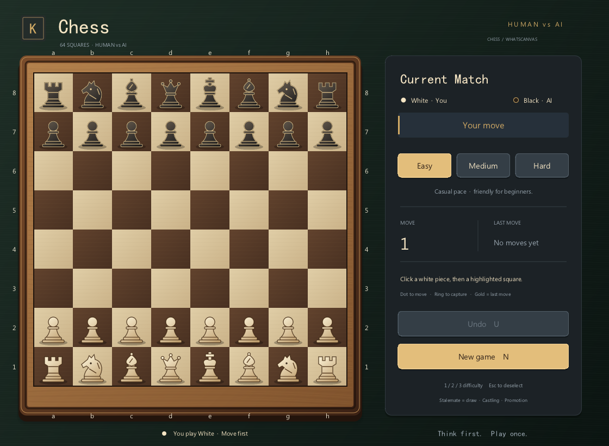

# 國際象棋 · WhatsCanvas

桌面人機國際象棋，使用繁體中文介面、深胡桃木棋盤與象牙／黑木棋子。棋盤、木紋、棋子輪廓、陰影、按鈕及提示全部由 WhatsCanvas 繪製；沒有外部圖片素材，也不依賴棋子字型。下圖是程式實際輸出的畫面。



## 執行

需要 CMake、C++17 編譯器及支援 OpenGL 3.3 的桌面環境；沿用倉庫的 GLFW／WhatsCanvas 建置依賴。目前已在 Windows / MSVC 驗證，尚未驗證 Linux、macOS，未實作行動或 Web 宿主。

在倉庫根目錄執行：

```powershell
.\examples\game\chess\build.bat
```

僅建置可加 `--no-run`。Visual Studio 多組態產物為 `examples/game/chess/build/Release/Chess.exe`，可用 `--difficulty easy|medium|hard` 指定開局難度。`build.sh` 提供相同的 CMake 建置入口。

## 操作與規則

玩家執白先行，電腦執黑。點選己方棋子，再點選提示位置落子。王車易位時，點選王及王的目的格。兵到達底線後會等待玩家選擇升變，選擇前不會送出 AI 回應。

| 操作 | 滑鼠／快捷鍵 |
| --- | --- |
| 難度 | 簡單／中等／難，或 `1`／`2`／`3` |
| 悔棋 | 「悔棋」或 `U`；簡單、中等可用，退回上一次玩家決策前，包含 AI 已走的回應 |
| 新局 | 「重新開局」或 `N`；進行中的棋局需要確認，`Enter` 確認、`Esc` 取消 |
| 升變 | 選擇后／車／象／馬，或 `Q`／`R`／`B`／`N`；`Esc` 取消升變選擇 |
| 申請和棋 | 條件成立時出現「申請和棋」，或按 `D` |
| 取消選子 | 再點原棋子、棋盤外，或 `Esc` |

實作將軍、自王安全、將死、逼和、兩側王車易位、吃過路兵及四種升變。參照 [FIDE 棋規](https://handbook.fide.com/chapter/e012023)，三次重複與五十回合提供和棋申請；五次重複與七十五回合自動和棋，將死優先。符合「預定下一步即可成立」時，面板會列出該步，申請不會實際執行它。AI 會接受自身可申請的和棋。

自動子力不足判定涵蓋雙裸王、單象／單馬對裸王及僅剩同色格象等常見情形；尚未判定所有特殊封鎖局面的死局。這是無棋鐘的休閒對局，未包含賽事觸子、裁判或計時程序。

## AI 與動畫

| 難度 | 決策方式 | 搜尋上限 | 悔棋 |
| --- | --- | --- | --- |
| 簡單 | 隨機合法走法，稍微偏好吃子 | 不作多層搜尋 | 可 |
| 中等 | 迭代加深、Negamax / Alpha-beta、子力與位置評分 | 2 層、18,000 節點、220 ms | 可 |
| 難 | 相同搜尋，增加推演深度 | 4 層、180,000 節點、1,000 ms | 不可 |

難度代表相對搜尋能力，並非棋力等級認證。搜尋在背景執行緒進行，使用棋局副本與取消旗標；悔棋、重開後，以版本號拒絕過期結果。中斷時保留合法候選走法。

棋子以固定大小沿平面滑行 320 ms，接續 160 ms 的落點與吃子淡化；王車易位同時移動王和車。升變以輪廓淡化交接，悔棋沿原路返回，途中悔棋從目前可見位置開始。選子、懸停、開局及勝負提示使用透明度過渡；沒有跳躍、抬升或縮放動畫。AI 回應至少等待 720 ms，讓玩家看清上一手。

## 程式結構與繪製成本

| 檔案 | 職責 |
| --- | --- |
| `Rules.h/.cpp` | 棋盤值物件、FEN、攻擊判定、合法走法、特殊走法、局面比較及 perft |
| `AI.h/.cpp` | 評分、走法排序、搜尋預算與取消 |
| `Game.h/.cpp` | 棋局歷史、勝負、和棋申請、悔棋、升變、輸入及非同步 AI 生命週期 |
| `Motion.h/.cpp` | 獨立時間軸、走棋前後快照、易位伴隨棋子及實際被吃位置 |
| `PieceArt.h/.cpp` | 六種西洋棋子的 Canvas 路徑與材質 |
| `Renderer.h/.cpp` | 程序化木紋、Image 圖集、保留式側欄紋理及畫面組合 |
| `Main.cpp` | GLFW 視窗、縮放與輸入、桌面冒煙測試、截圖及幀時間量測 |
| `AnimationTests.h/.cpp` | 可控制時鐘的真實 GPU 畫面與特殊走法動畫測試 |
| `tests/Tests.cpp` | 無視窗棋規／互動／AI 測試及獨立驗證通訊入口 |
| `tests/compare_oracle.py` | 與測試專用 python-chess 比對合法走法及走棋結果 |

靜態棋盤、12 個棋子外觀與效果預先透過 Software Canvas 烘焙為 `Image`；逐幀只組合圖片及少量標記。側欄使用保留的離屏 Canvas 紋理，只在狀態改變時更新，不逐幀回讀像素。動畫期間不重建棋子圖集，視窗縮放使用一致的設計座標與輸入反算。FEN 入口供測試建立局面，檢查格式，並不保證任意輸入局面在歷史上可達。

## 驗證

一鍵建置、執行所有測試並輸出實際桌面截圖：

```powershell
.\examples\game\chess\verify.ps1
# 沒有 GPU 的環境可只執行棋規、互動狀態與 AI 測試：
.\examples\game\chess\verify.ps1 -CoreOnly
```

驗證分三層，CTest 任一項失敗會回傳非零值：

1. `ChessRulesAndPlay`：初始局面 perft 深度 1–4（20、400、8,902、197,281）、Kiwipete 深度 1–3、車兵殘局深度 4；易位穿越將軍、吃過路兵被牽制、升變與悔棋、重複局面與和棋申請、AI 取消、三檔合法回應，以及 AI 自我對弈至終局。
2. `ChessDesktopSmoke`：使用真實 OpenGL 畫面與視窗輸入處理路徑，走完玩家落子 → AI 回應 → 悔棋 → 切換難度／新局；檢查側欄像素、縮放後命中、熱幀不重建快取、不重新光柵化文字，量測 180 幀並以 `glFinish` 等待 GPU 完成。
3. `ChessAnimationSmoke`：控制時鐘並比較棋子所在區域的實際像素，驗證中途位置、王車同步移動、過路兵實際消失位置、升變選擇與外觀、悔棋及勝負淡入。以 16.67 ms 的 p95 作為本機 60 fps 渲染預算檢查。

本機 Windows / OpenGL、1120 × 820 的驗證結果：CTest 3/3 通過；穩定畫面 2 次 draw call，普通走棋動畫最多 5 次。實測穩定畫面 GPU 完成 p95 約 0.2 ms、動畫低於 1 ms；這些是本機渲染量測，不包含首次材質烘焙，也不保證其他裝置相同表現。

另外可使用獨立棋規實作交叉驗證。以下依賴僅供測試，遊戲本身不使用 Python，也不連結或散布 python-chess：

```powershell
python -m venv examples/game/chess/build/oracle-env
examples/game/chess/build/oracle-env/Scripts/python -m pip install python-chess==1.999
examples/game/chess/build/oracle-env/Scripts/python examples/game/chess/tests/compare_oracle.py --engine examples/game/chess/build/Release/ChessTests.exe
```

已使用 python-chess 1.999（chess 1.11.2）通過 **1,098 個局面、33,104 個走棋後局面**，逐一比對所有合法走法、子局面 FEN、將軍及常見子力不足判定。樣本包含固定種子的隨機對弈與雙色特殊規則局面。

輸出截圖或動畫逐幀圖供人工複查：

```powershell
examples/game/chess/build/Release/Chess.exe --capture examples/game/chess/build/opening.ppm
examples/game/chess/build/Release/Chess.exe --animation-test --frames-dir examples/game/chess/build/frames
```

人工試玩可依序完成：`e2 → e4`、等待黑方、按 `U`、切換三檔難度、取消及確認新局、縮放視窗後再次選子落子。升變、易位、吃過路兵與終局則由固定局面的自動測試重現。
