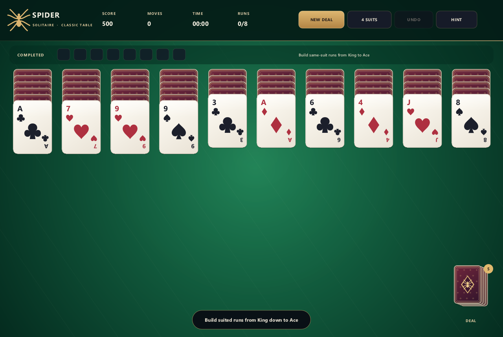

# Spider Solitaire

A polished, fully playable Spider Solitaire game rendered entirely with WhatsCanvas.
It includes 1/2/4-suit difficulty, undo and hints, responsive high-DPI input, and animated dealing and completed-run collection.



```sh
./build.sh
```

Build scripts default to `Release` for smooth gameplay. Pass `--debug` when a debug build is needed.

Android host files now live under `examples/game/spider_solitaire/android`.
Build from `platforms/android` with:

```sh
./gradlew :spider:assembleDebug
```

Web host files live under `examples/game/spider_solitaire/web`.
Build and serve with:

```sh
cd web
./build.sh
./serve.sh
```

Then open `http://127.0.0.1:8081/spider.html`.
Optional URL params:
`?suits=1|2|4&seed=<uint32>&dpr=1..4&cache=0|1&raster=0|1&atlas=0|1&touch=0|1&intro=0|1`.

Mouse controls: click or drag a same-suit descending run onto an empty column or a card one rank higher. Click the stock to deal another row. Empty columns must be filled before dealing.

Keyboard shortcuts: `N` new deal, `U` undo, `H` hint, `1`/`2`/`4` difficulty,
`C` cycle difficulty, `Esc` quit.

Run the deterministic rules suite without opening a window:

```sh
./build/SpiderSolitaire --self-test
```

The Android port includes deterministic drag profiling and a native Android
Canvas control renderer. See the
[interactive performance case study](../../../doc/ANDROID_INTERACTIVE_PERFORMANCE.md)
for the 1 FPS regression, shared card-atlas design, animation review, and final
device measurements.
