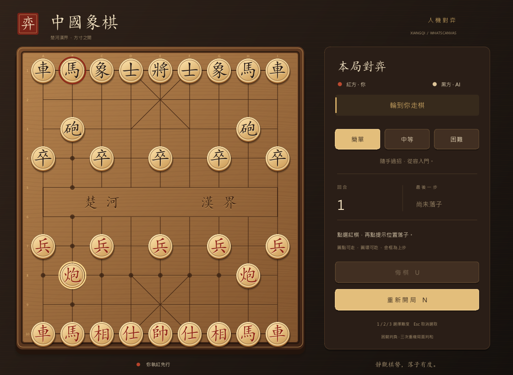

# 中國象棋 · Xiangqi

WhatsCanvas 桌面人機象棋。繁體介面、深胡桃木棋盤、楷體雕刻棋子、合法落點提示、上一步標記及落子動畫。玩家執紅先行，AI 執黑。



## 建置與執行

在本目錄執行，預設為 Release：

```powershell
.\build.bat
```

Linux / macOS 桌面：

```sh
sh build.sh
```

可加入 `--no-run` 只建置，或 `--debug` 建置 Debug。也可以直接使用 CMake：

```powershell
cmake -S . -B build
cmake --build build --config Release --parallel
.\build\Release\Xiangqi.exe
```

依賴與相鄰遊戲示例一致：C++17、CMake、GLFW、OpenGL 3.3，以及儲存庫內的 WhatsCanvas 相依項目。非 Visual Studio 產生器的執行檔通常位於 `build/Xiangqi`。本版僅有桌面宿主；已實測 Windows，Linux / macOS 的建置入口尚未在相應系統實測。

## 操作

| 操作 | 方法 |
|---|---|
| 走棋 | 點選紅棋，再點合法位置；圓點表示可走，圓環表示可吃 |
| 取消選取 | 再點已選棋子、棋盤外，或按 `Esc` |
| 悔棋 | 按鈕或 `U`；簡單、中等可用 |
| 切換難度 | 按鈕或 `1` / `2` / `3` |
| 重新開局 | 按鈕或 `N` |
| 重開確認 | 進行中的對局需確認；`Enter` 確認，`Esc` 取消 |
| 離開 | 關閉視窗 |

悔棋退回玩家上次走棋前：AI 已應手時，同時撤銷雙方這一輪；AI 正在思考時，撤銷玩家剛走的一步並取消搜尋。可逐輪往回撤銷。困難模式禁用悔棋。勝負或和棋後仍可在允許的難度悔棋，或直接重開。

動作採貼著棋盤的平面滑動，棋子的大小與高度保持不變，沒有跳躍、抬升、彈跳或縮放。開局棋子、選取描邊、合法落點、吃子、將軍／勝負提示與按鈕回饋使用淡入淡出或亮度變化。

每步包含 320 ms 平滑移動與 160 ms 落點／吃子淡出。AI 可同步搜尋，但最快在玩家落子後 720 ms 才應手，確保上一段動作不被覆蓋。移動期間鎖定棋盤輸入，悔棋與重開仍可使用；悔棋逐步倒放，途中撤銷則從棋子當前畫面位置原路退回。非法落點會短暫標記並保留選取。

預設中等難度，也可透過 `--difficulty easy|medium|hard` 選擇。

| 難度 | AI | 搜尋上限 |
|---|---|---|
| 簡單 | 隨機合法走法，對吃子給少量偏好，不預判應手 | 一層選擇 |
| 中等 | 子力／位置評估、吃子排序、迭代加深 Alpha-Beta | 2 層、18,000 節點、220 毫秒 |
| 困難 | 同一評估器，更深的應手搜尋 | 4 層、180,000 節點、1,000 毫秒 |

任一預算耗盡即停止，保留最後完整搜尋層的走法；最差情況也保有一個合法候選。這是輕量示例 AI，沒有開局庫、殘局庫或棋力等級承諾。

## 規則範圍

包含七種棋子的走法、九宮、象不過河、蹩馬腿、塞象眼、炮架、過河兵、將帥照面、自陷將軍限制，以及將死／困斃判負。

和棋採適合休閒對弈的明確簡化：同一棋盤與行棋方出現三次判和；連續 120 個半回合沒有吃子或動兵判和。將死／困斃優先於和棋判定。**未實作正式比賽的長將、長捉責任裁定**。

## 程式組織與繪製

| 檔案 | 職責 |
|---|---|
| `Rules.h/.cpp` | 棋盤值型別、攻擊判定、合法走法、perft |
| `AI.h/.cpp` | 評估、搜尋、時間／節點預算、取消 |
| `Game.h/.cpp` | 對局歷史、結果、悔棋、點擊操作、非同步 AI 協調 |
| `Motion.h/.cpp` | 前後棋盤快照、動作階段、可注入時鐘與倒放時間軸 |
| `Renderer.h/.cpp` | 材質、字型、棋盤／棋子圖集、側欄紋理、動畫 |
| `Main.cpp` | GLFW 桌面宿主、DPI／縮放、輸入、桌面驗證 |
| `tests/Tests.cpp` | 無視窗規則、AI、對局與交互測試 |
| `AnimationTests.h/.cpp` | 固定時間步長的真實 OpenGL 動畫像素／效能測試 |

所有美術素材均由 Canvas 繪製，執行時不讀取 PNG、JPEG、SVG 或網路資源。木紋由固定數學曲線生成；字型取自系統，Windows 優先使用微軟正黑體與楷體，缺少時走 WhatsCanvas 的 CJK 字型回退。`screenshot.png` 只供文件展示。

- 棋盤和桌面烘焙為一張 `Image`；14 種棋子共用一張 896×256 圖集，每枚棋子只需一次 `drawImage`。
- 棋盤快取按畫素縮放選 1×／2×，棋子固定 2×。側欄使用持續存在的 OpenGL 離屏 Canvas，僅在對局或確認框狀態變更時重繪；主畫面直接取用其紋理，避免讀回與重新上傳。
- 穩定畫面不重新繪製文字或木紋、不烘焙圖集、不上傳棋子材質。選取、落點及將軍標記是少量動態圖元。
- 光圈與將軍／勝負文字另用一張 Canvas 生成的效果圖集。動畫只改位置與透明度，不逐幀重建材質或側欄；側欄狀態更新不會重新啟動棋子動畫。
- AI 僅接收棋盤副本與取消旗標，不碰 Canvas。重開／悔棋增加世代編號，過期結果不會寫回新對局；關閉時取消並回收工作執行緒。
- 視窗採等比例縮放與留邊，輸入經同一 viewport 反向映射，支援 DPI 變化與視窗縮放。

## 可玩性與效能驗證

```powershell
.\verify.ps1
```

此指令建置 Release，執行 CTest，並輸出實際桌面截圖至 `build/verification.ppm`。不需要顯示的 CI 可以只驗證核心：

```powershell
.\verify.ps1 -CoreOnly
```

也可分開執行：

```powershell
ctest --test-dir build -C Release --output-on-failure -V
.\build\Release\XiangqiTests.exe
.\build\Release\Xiangqi.exe --smoke-test --capture build/verification.ppm
.\build\Release\Xiangqi.exe --capture build/opening.ppm
.\build\Release\Xiangqi.exe --animation-test
.\build\Release\Xiangqi.exe --animation-test --frames-dir build/animation-frames
```

核心測試不需圖形環境，涵蓋 640 項檢查：

- 開局 perft 1／2／3 層：44、1920、79666，並逐項測試特殊走法、遮擋、應將及非法輸入。
- 將死、困斃、三次重複、無進展計數、終局鎖定、終局悔棋及重開。
- 三檔 AI 的合法性、預算與取消；中等／困難找出一步將死；完整自動對弈走到終局。
- 玩家選子、非法落點、AI 回應、思考中悔棋、過期結果丟棄、難度切換確認／取消、四種尺寸下全部 90 個交點的映射。
- 用可注入時鐘驗證捕獲快照、移動／落點階段、AI 最短停頓、動作輸入鎖定、逐步悔棋、途中原路退回，以及側欄更新不打斷移動。

動畫測試另外以固定時間步長擷取真實 OpenGL 像素，確認棋子經過途中位置、選取與移動時字面像素保持原尺寸、吃子與悔棋的像素變化、提示出現／消失及按鈕回饋。`--frames-dir` 可匯出逐幀 PPM 供人工檢視。這部分獨立計量動畫畫格的 draw call 與同步完成時間，不以空閒畫面的數字代替。

桌面測試建立隱藏的真實 GLFW／OpenGL 視窗，透過正式宿主的座標輸入路徑與鍵盤回呼執行三檔人機流程，檢查實際像素變更、側欄紋理正確性及縮放後落點。它是內建輸入注入測試，並非外部作業系統滑鼠自動化。效能門檻要求穩定畫面不重新烘焙、無新字形光柵化、最多 12 個 draw call，並以 `glFinish` 同步完成的 p95 畫格耗時小於 16.67 毫秒。

2026-09-07，Windows / Release、Core i7-10700、RTX 2080 Ti 實測：

| 項目 | 結果 |
|---|---|
| CTest | 3 / 3 通過，640 項核心檢查，另含動畫像素驗證 |
| 自動對局 | 75 個半回合，以三次重複和棋結束 |
| 開局中等／困難搜尋 | 2 層約 2.7 ms／4 層約 517 ms |
| 穩定畫面 | 35 條 Canvas 命令、2 個實際 draw call |
| 180 畫格 CPU 提交 | 中位數 0.028 ms，p95 0.036 ms |
| 180 畫格同步完成 | 中位數 0.128 ms，p95 0.193 ms |
| 78 畫格動畫序列 | 同步完成 p95 0.721 ms，最多 5 個 draw call |

上述畫格數據為 1120×820 的暖快取測量，排除初次字型／美術烘焙與顯示器交換等待；不是跨硬體效能保證。測試同時輸出 AI 思考期間的渲染次數及側欄更新耗時，避免只測量空閒畫面。
